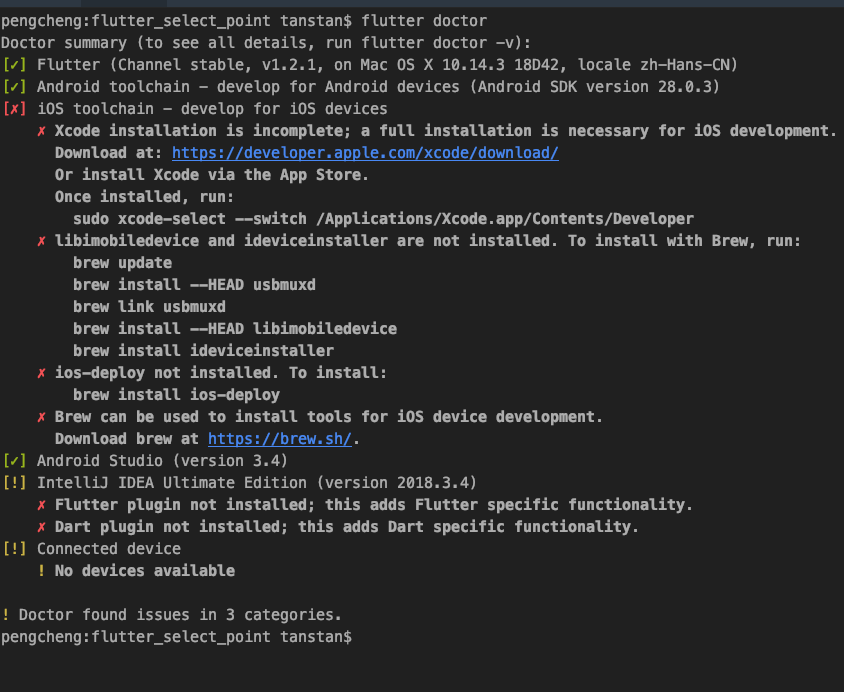
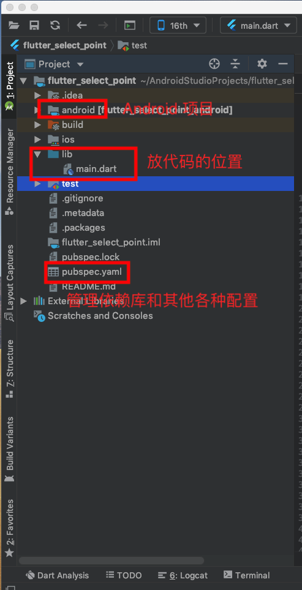

# Flutter


## 环境配置

### 1. Flutter官网下载SDK. 

### 2. 配置Flutter SDK环境变量.  

### 3. 在Android Studio中安装Flutter插件.  

### 4. 运行命令`flutter doctor`如果得到以下画面，恭喜你环境安装成功。 

  


## 项目结构  

### 1. Flutter项目结构  
  

### 2. Android项目中的配置

#### Activity. 

```kotlin
  @Override
  protected void onCreate(Bundle savedInstanceState) {
    super.onCreate(savedInstanceState);
    GeneratedPluginRegistrant.registerWith(this);
  } 
	
```

#### Gradle.

```
def localProperties = new Properties()
def localPropertiesFile = rootProject.file('local.properties')
if (localPropertiesFile.exists()) {
    localPropertiesFile.withReader('UTF-8') { reader ->
        localProperties.load(reader)
    }
}

def flutterRoot = localProperties.getProperty('flutter.sdk')
if (flutterRoot == null) {
    throw new GradleException("Flutter SDK not found. Define location with flutter.sdk in the local.properties file.")
}

def flutterVersionCode = localProperties.getProperty('flutter.versionCode')
if (flutterVersionCode == null) {
    flutterVersionCode = '1'
}

def flutterVersionName = localProperties.getProperty('flutter.versionName')
if (flutterVersionName == null) {
    flutterVersionName = '1.0'
}

apply plugin: 'com.android.application'
apply from: "$flutterRoot/packages/flutter_tools/gradle/flutter.gradle"

android {
    compileSdkVersion 28

    lintOptions {
        disable 'InvalidPackage'
    }

    defaultConfig {
        // TODO: Specify your own unique Application ID (https://developer.android.com/studio/build/application-id.html).
        applicationId "com.example.flutter_tabs"
        minSdkVersion 16
        targetSdkVersion 28
        versionCode flutterVersionCode.toInteger()
        versionName flutterVersionName
        testInstrumentationRunner "android.support.test.runner.AndroidJUnitRunner"
    }

    buildTypes {
        release {
            // TODO: Add your own signing config for the release build.
            // Signing with the debug keys for now, so `flutter run --release` works.
            signingConfig signingConfigs.debug
        }
    }
}

flutter {
    source '../..'
}

dependencies {
    testImplementation 'junit:junit:4.12'
    androidTestImplementation 'com.android.support.test:runner:1.0.2'
    androidTestImplementation 'com.android.support.test.espresso:espresso-core:3.0.2'
}


```


## 第一个Flutter应用解析

### 1. Widget.  
> Flutter Widget采用现代响应式框架构建，这是从 React 中获得的灵感，中心思想是用widget构建你的UI。 Widget描述了他们的视图在给定其当前配置和状态时应该看起来像什么。当widget的状态发生变化时，widget会重新构建UI，Flutter会对比前后变化的不同， 以确定底层渲染树从一个状态转换到下一个状态所需的最小更改（译者语：类似于React/Vue中虚拟DOM的diff算法）。

### 2. StatelessWidget. 
简单来说就是其内部没有状态的保存。 

### 3. StatefultWidget. 
内部通过State来保存Widget的状态，通常State的生命周期比Widget生命周期长，当Widget重建的时候，Stage不一定重建。  

### 4. 代码. 

```dart
import 'package:flutter/material.dart';

void main() => runApp(MyApp());

class MyApp extends StatelessWidget {
  @override
  Widget build(BuildContext context) {
    return MaterialApp(
      title: 'Flutter Demo',
      theme: ThemeData(
        primarySwatch: Colors.blue,
      ),
      home: MyHomePage(title: 'Flutter Demo Home Page'),
    );
  }
}

class MyHomePage extends StatefulWidget {
  MyHomePage({Key key, this.title}) : super(key: key);

  final String title;

  @override
  _MyHomePageState createState() => _MyHomePageState();
}

class _MyHomePageState extends State<MyHomePage> {
  int _counter = 0;

  void _incrementCounter() {
    setState(() {
      _counter++;
    });
  }

  @override
  Widget build(BuildContext context) {
    return Scaffold(
      appBar: AppBar(
        title: Text(widget.title),
      ),
      body: Center(
        child: Column(
          mainAxisAlignment: MainAxisAlignment.center,
          children: <Widget>[
            Text(
              'You have pushed the button this many times:',
            ),
            Text(
              '$_counter',
              style: Theme.of(context).textTheme.display1,
            ),
          ],
        ),
      ),
      floatingActionButton: FloatingActionButton(
        onPressed: _incrementCounter,
        tooltip: 'Increment',
        child: Icon(Icons.add),
      ),
    );
  }
}


```


## 常用系统Widget   

### 布局类Widget  

#### 线性布局Row, Column  
> 所谓线性布局，即指沿水平或垂直方向排布子Widget。Flutter中通过Row和Column来实现线性布局，类似于Android中的LinearLayout控件。Row和Column都继承自Flex，我们将在弹性布局一节中详细介绍Flex。

#### 弹性布局Flex  
> 弹性布局允许子widget按照一定比例来分配父容器空间，弹性布局的概念在其UI系统中也都存在，如H5中的弹性盒子布局，Android中的FlexboxLayout。Flutter中的弹性布局主要通过Flex和Expanded来配合实现。  
> Flex可以沿着水平或垂直方向排列子widget，如果你知道主轴方向，使用Row或Column会方便一些，因为Row和Column都继承自Flex，参数基本相同，所以能使用Flex的地方一定可以使用Row或Column。Flex本身功能是很强大的，它也可以和Expanded配合实现弹性布局，接下来我们只讨论Flex和弹性布局相关的属性(其它属性已经在介绍Row和Column时介绍过了)。

配合Expanded代码：

```dart

const Expanded({
  int flex = 1, 
  @required Widget child,
})

```

#### 流式布局Wrap

> 在介绍Row和Colum时，如果子widget超出屏幕范围，则会报溢出错误.   
> 这是因为Row默认只有一行，如果超出屏幕不会折行。我们把超出屏幕显示范围会自动折行的布局称为流式布局。Flutter中通过Wrap和Flow来支持流式布局，将上例中的Row换成Wrap后溢出部分则会自动折行。  


#### 层叠布局Stack, Positioned  

> 层叠布局和Web中的绝对定位、Android中的Frame布局是相似的，子widget可以根据到父容器四个角的位置来确定本身的位置。绝对定位允许子widget堆叠（按照代码中声明的顺序）。Flutter中使用Stack和Positioned来实现绝对定位，Stack允许子widget堆叠，而Positioned可以给子widget定位（根据Stack的四个角）。 

```
Stack({
  this.alignment = AlignmentDirectional.topStart,
  this.textDirection,
  this.fit = StackFit.loose,
  this.overflow = Overflow.clip,
  List<Widget> children = const <Widget>[],
})

```

```
const Positioned({
  Key key,
  this.left, 
  this.top,
  this.right,
  this.bottom,
  this.width,
  this.height,
  @required Widget child,
})
```


### 容器类Widget  

#### Padding  
Padding可以给其子节点添加补白, 类似Android中的padding属性。  

#### 布局限制类容器ConstrainedBox, SizedBox  

ConstrainedBox
> ConstrainedBox用于对子widget添加额外的约束。例如，如果你想让子widget的最小高度是80像素，你可以使用const BoxConstraints(minHeight: 80.0)作为子widget的约束。  


```
ConstrainedBox(
  constraints: BoxConstraints(
    minWidth: double.infinity, //宽度尽可能大
    minHeight: 50.0 //最小高度为50像素
  ),
  child: Container(
      height: 5.0, 
      child: redBox 
  ),
)
```

SizedBox
> SizedBox用于给子widget指定固定的宽高.  


#### 装饰容器DecoratedBox  
> DecoratedBox可以在其子widget绘制前(或后)绘制一个装饰Decoration（如背景、边框、渐变等）。 

```
const DecoratedBox({
  Decoration decoration,
  DecorationPosition position = DecorationPosition.background,
  Widget child
})
```

BoxDecoration
> 我们通常会直接使用BoxDecoration，它是一个Decoration的子类，实现了常用的装饰元素的绘制。 

```
BoxDecoration({
  Color color, //颜色
  DecorationImage image,//图片
  BoxBorder border, //边框
  BorderRadiusGeometry borderRadius, //圆角
  List<BoxShadow> boxShadow, //阴影,可以指定多个
  Gradient gradient, //渐变
  BlendMode backgroundBlendMode, //背景混合模式
  BoxShape shape = BoxShape.rectangle, //形状
})
```
#### 变换Transform. 
> Transform可以在其子Widget绘制时对其应用一个矩阵变换（transformation），Matrix4是一个4D矩阵，通过它我们可以实现各种矩阵操作。

```
Container(
  color: Colors.black,
  child: new Transform(
    alignment: Alignment.topRight, //相对于坐标系原点的对齐方式
    transform: new Matrix4.skewY(0.3), //沿Y轴倾斜0.3弧度
    child: new Container(
      padding: const EdgeInsets.all(8.0),
      color: Colors.deepOrange,
      child: const Text('Apartment for rent!'),
    ),
  ),
);
```

#### Container.  
> 它是DecoratedBox、ConstrainedBox、Transform、Padding、Align等widget的一个组合widget。所以我们只需通过一个Container可以实现同时需要装饰、变换、限制的场景。 

```
Container({
  this.alignment,
  this.padding, //容器内补白，属于decoration的装饰范围
  Color color, // 背景色
  Decoration decoration, // 背景装饰
  Decoration foregroundDecoration, //前景装饰
  double width,//容器的宽度
  double height, //容器的高度
  BoxConstraints constraints, //容器大小的限制条件
  this.margin,//容器外补白，不属于decoration的装饰范围
  this.transform, //变换
  this.child,
})
```


### 可滚动的Widget  

#### SingleChildScrollView
> SingleChildScrollView类似于Android中的ScrollView，它只能接收一个子Widget。

```
SingleChildScrollView({
  this.scrollDirection = Axis.vertical, //滚动方向，默认是垂直方向
  this.reverse = false, 
  this.padding, 
  bool primary, 
  this.physics, 
  this.controller,
  this.child,
})

```

#### ListView  

> ListView是最常用的可滚动widget，它可以沿一个方向线性排布所有子widget。

```
ListView({
  ...  
  //可滚动widget公共参数
  Axis scrollDirection = Axis.vertical,
  bool reverse = false,
  ScrollController controller,
  bool primary,
  ScrollPhysics physics,
  EdgeInsetsGeometry padding,

  //ListView各个构造函数的共同参数  
  double itemExtent,
  bool shrinkWrap = false,
  bool addAutomaticKeepAlives = true,
  bool addRepaintBoundaries = true,
  double cacheExtent,

  //子widget列表
  List<Widget> children = const <Widget>[],
})

```

重要参数：

- itemExtent  
该参数如果不为null，则会强制children的"长度"为itemExtent的值；这里的"长度"是指滚动方向上子widget的长度，即如果滚动方向是垂直方向，则itemExtent代表子widget的高度，如果滚动方向为水平方向，则itemExtent代表子widget的长度。在ListView中，指定itemExtent比让子widget自己决定自身长度会更高效，这是因为指定itemExtent后，滚动系统可以提前知道列表的长度，而不是总是动态去计算，尤其是在滚动位置频繁变化时（滚动系统需要频繁去计算列表高度）。  

- shrinkWrap   
该属性表示是否根据子widget的总长度来设置ListView的长度，默认值为false 。默认情况下，ListView的会在滚动方向尽可能多的占用空间。当ListView在一个无边界(滚动方向上)的容器中时，shrinkWrap必须为true。  

- addAutomaticKeepAlives  
该属性表示是否将列表项（子widget）包裹在AutomaticKeepAlive widget中；典型地，在一个懒加载列表中，如果将列表项包裹在AutomaticKeepAlive中，在该列表项滑出视口时该列表项不会被GC，它会使用KeepAliveNotification来保存其状态。如果列表项自己维护其KeepAlive状态，那么此参数必须置为false。 

ListView.builder
> ListView.builder适合列表项比较多（或者无限）的情况，因为只有当子Widget真正显示的时候才会被创建。

ListView.separated
> ListView.separated可以生成列表项之间的分割器，它除了比ListView.builder多了一个separatorBuilder参数，该参数是一个分割器生成器。

```
class ListView3 extends StatelessWidget {
  @override
  Widget build(BuildContext context) {
    //下划线widget预定义以供复用。  
    Widget divider1=Divider(color: Colors.blue,);
    Widget divider2=Divider(color: Colors.green);
    return ListView.separated(
        itemCount: 100,
        //列表项构造器
        itemBuilder: (BuildContext context, int index) {
          return ListTile(title: Text("$index"));
        },
        //分割器构造器
        separatorBuilder: (BuildContext context, int index) {
          return index%2==0?divider1:divider2;
        },
    );
  }
}
```

#### GridView  
> GridView可以构建一个二维网格列表。  

```
GridView({
  Axis scrollDirection = Axis.vertical,
  bool reverse = false,
  ScrollController controller,
  bool primary,
  ScrollPhysics physics,
  bool shrinkWrap = false,
  EdgeInsetsGeometry padding,
  @required SliverGridDelegate gridDelegate, //控制子widget layout的委托
  bool addAutomaticKeepAlives = true,
  bool addRepaintBoundaries = true,
  double cacheExtent,
  List<Widget> children = const <Widget>[],
})
```

SliverGridDelegateWithFixedCrossAxisCount

> 该子类实现了一个横轴为固定数量子元素的layout算法.  

```
SliverGridDelegateWithFixedCrossAxisCount({
  @required double crossAxisCount, 
  double mainAxisSpacing = 0.0,
  double crossAxisSpacing = 0.0,
  double childAspectRatio = 1.0,
})

```

#### CustomScrollView

> CustomScrollView是可以使用sliver来自定义滚动模型（效果）的widget。它可以包含多种滚动模型，举个例子，假设有一个页面，顶部需要一个GridView，底部需要一个ListView，而要求整个页面的滑动效果是统一的，即它们看起来是一个整体，如果使用GridView+ListView来实现的话，就不能保证一致的滑动效果，因为它们的滚动效果是分离的，所以这时就需要一个"胶水"，把这些彼此独立的可滚动widget（Sliver）"粘"起来，而CustomScrollView的功能就相当于“胶水”。  

Sliver
> Sliver有细片、小片之意，在Flutter中，Sliver通常指具有特定滚动效果的可滚动块。可滚动widget，如ListView、GridView等都有对应的Sliver实现如SliverList、SliverGrid等。对于大多数Sliver来说，它们和可滚动Widget最主要的区别是Sliver不会包含Scrollable Widget，也就是说Sliver本身不包含滚动交互模型 ，正因如此，CustomScrollView才可以将多个Sliver"粘"在一起，这些Sliver共用CustomScrollView的Scrollable，最终实现统一的滑动效果。  

>> Sliver系列Widget比较多，我们不会一一介绍，读者只需记住它的特点，需要时再去查看文档即可。上面之所以说“大多数“Sliver都和可滚动Widget对应，是由于还有一些如SliverPadding、SliverAppBar等是和可滚动Widget无关的，它们主要是为了结合CustomScrollView一起使用，这是因为CustomScrollView的子widget必须都是Sliver。 


### 功能型Widget  

> 功能型Widget指的是不会影响UI布局及外观的Widget，它们通常具有一定的功能，如事件监听、数据存储等，我们之前介绍过的FocusScope（焦点控制）、PageStorage（数据存储）、NotificationListener（事件监听）都属于功能型Widget。由于Widget是Flutter的一等公民，功能型Widget非常多，我们不会去一一介绍.  


#### 导航返回拦截WillPopScope
> 为了避免用户误触返回按钮而导致APP退出，在很多APP中都拦截了用户点击返回键的按钮，当用户在某一个时间段内点击两次时，才会认为用户是要退出（而非误触）。  

```
const WillPopScope({
  ...
  @required WillPopCallback onWillPop,
  @required Widget child
})

```