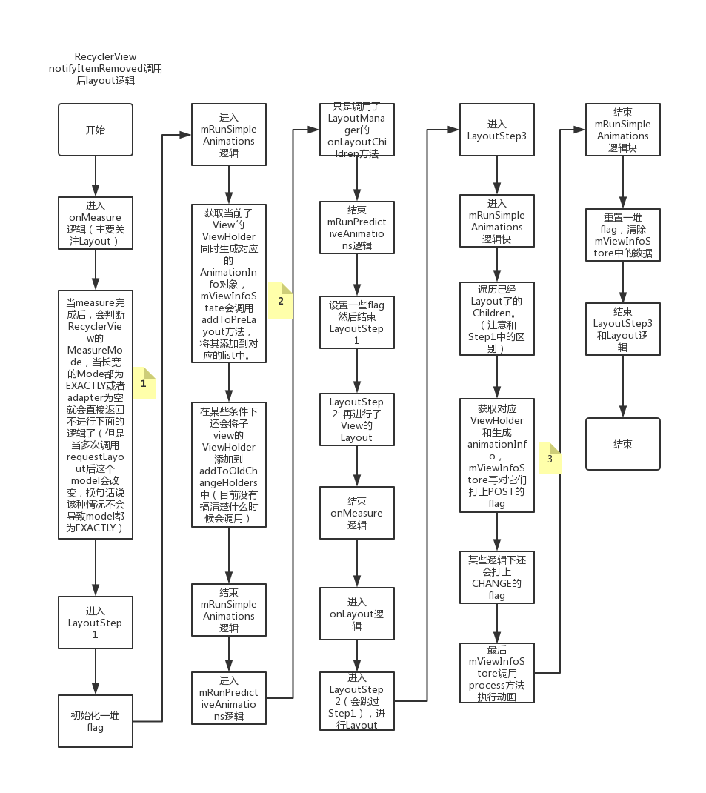
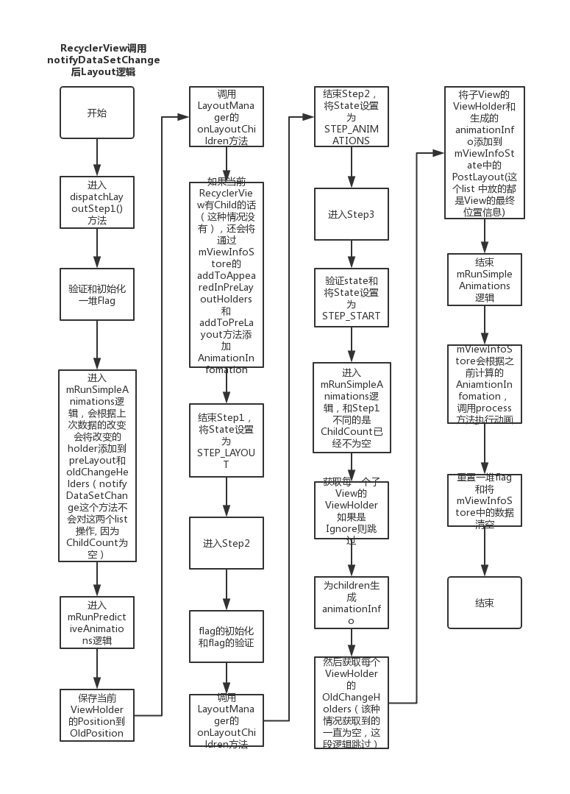

# 流氓控件——RecyclerView（上）
  
相信大家对于RecyclerView都非常熟悉，这是Google在Android 5.0发布时，一同发布的一个控件。它默认能够实现列表、网格、瀑布流等UI式样。由于它的性能比它的前辈们更加好，可定制性也更加强，现在的开发也基本上放弃使用ListView和GridView等一些年纪比较大的列表控件；在2019年的Google IO大会上推出了ViewPager2，它的实现也是通过RecyclerView，性能无疑也是优于现在的ViewPager，现在的ViewPager被替换掉也只是时间的问题；还有某些知名的库利用RecyclerView对子View懒加载的特性，用来提高UI渲染的性能；甚至还有人用RecyclerView[画龙](https://blog.csdn.net/u011387817/article/details/81875021)；RecyclerView能干很多控件能干的事情，更加恐怖的是，它还能干得更加好，当之无愧的流氓控件。  

*Tips: 源码版本：com.google.android.material:material:1.1.0-alpha10* 

## onMeasure, onLayout, onDraw流程分析

在本阶段主要分析onLayout的过程。
  
### onMeasure

RecyclerView onMeasure方法部分代码： 


```java

@Override
    protected void onMeasure(int widthSpec, int heightSpec) {
        if (mLayout == null) {
            defaultOnMeasure(widthSpec, heightSpec);
            return;
        }
        // LinearLayoutManager 默认是AutoMeasure的，暂时也只考虑这种情况。
        if (mLayout.isAutoMeasureEnabled()) {
            final int widthMode = MeasureSpec.getMode(widthSpec);
            final int heightMode = MeasureSpec.getMode(heightSpec);

            /**
             * This specific call should be considered deprecated and replaced with
             * {@link #defaultOnMeasure(int, int)}. It can't actually be replaced as it could
             * break existing third party code but all documentation directs developers to not
             * override {@link LayoutManager#onMeasure(int, int)} when
             * {@link LayoutManager#isAutoMeasureEnabled()} returns true.
             */
             // 调用layoutManager的onMeasure方法，LinearLayoutManager中默认使用的是RecyclerView中的defaultOnMeasure方法。
            mLayout.onMeasure(mRecycler, mState, widthSpec, heightSpec);
				
            final boolean measureSpecModeIsExactly =
                    widthMode == MeasureSpec.EXACTLY && heightMode == MeasureSpec.EXACTLY;
            
            /** 当withMode和heightMode都为EXACTLY时或者mAdapter为空的时候直接返回，
             * 但是当第一次requestLayout的时候withMode和heightModel都为EXACTLY时，后面再次调notify
             * 的方法时这个mode有可能会改变，后面在分析notifyItemRemoved的时候会说到（但是还不清楚为啥）
             */
            if (measureSpecModeIsExactly || mAdapter == null) {
                return;
            }

            if (mState.mLayoutStep == State.STEP_START) {
            	// 进入LayoutStep1逻辑
                dispatchLayoutStep1();
            }
            // set dimensions in 2nd step. Pre-layout should happen with old dimensions for
            // consistency
            mLayout.setMeasureSpecs(widthSpec, heightSpec);
            mState.mIsMeasuring = true;
            // 进入LayoutStep2逻辑
            dispatchLayoutStep2();

            // now we can get the width and height from the children.
            // 再次通过已经measure的children再次进行measure
            mLayout.setMeasuredDimensionFromChildren(widthSpec, heightSpec);

            // if RecyclerView has non-exact width and height and if there is at least one child
            // which also has non-exact width & height, we have to re-measure.
            if (mLayout.shouldMeasureTwice()) {
                mLayout.setMeasureSpecs(
                        MeasureSpec.makeMeasureSpec(getMeasuredWidth(), MeasureSpec.EXACTLY),
                        MeasureSpec.makeMeasureSpec(getMeasuredHeight(), MeasureSpec.EXACTLY));
                mState.mIsMeasuring = true;
                dispatchLayoutStep2();
                // now we can get the width and height from the children.
                mLayout.setMeasuredDimensionFromChildren(widthSpec, heightSpec);
            }
        } else {
            ...
        }
    }

```

AutoMeasureEnable逻辑：首先会调用LayoutManager的onMeasure方法，在LinearLayoutManger中默认也是调用的defaultOnMeasure方法，这个方法中就只是加上padding值和本身的size作为最后的size。heightMode和widthMode都为EXACTLY时或者adapter为空时会直接结束测量流程（但是某些情况下这个mode会改变）。然后进入LayoutStep1和LayoutStep2，这两个方法后面会讲到。最后通过已经测量好的children再对自己进行测量。 

  
### onDraw

RecyclerView onDraw方法：

```

@Override
    public void onDraw(Canvas c) {
        super.onDraw(c);

        final int count = mItemDecorations.size();
        for (int i = 0; i < count; i++) {
            mItemDecorations.get(i).onDraw(c, this, mState);
        }
    }

``` 

onDraw方法确实有点简单，直接调用了Decorations的onDraw()方法，关于Decoration我们后面再看。  

### onLayout

onLayout方法就相对比较复杂了，其除了真实的layout逻辑（这些逻辑是LayoutManager完成的），主要的代码都是为了处理动画。 
   
onLayout步骤：
  
  - LayoutStep1
    
  	进行PreLayout，也就是将上次Children的位置信息记录下来，然后供动画使用（还有做了一些其他的事情没有看懂了）。 给一个官方的描述：
  	
   > /**
   >  * The first step of a layout where we; <br>
   >  * - process adapter updates <br>
   >  * - decide which animation should run <br>
   >  * - save information about current views <br>
   >  * - If necessary, run predictive layout and save its information <br>
   >  */
  	
  - LayoutStep2
  
  进行真实的Layout逻辑，该逻辑是通过layoutManager的onLayoutChildren方法实现的。 
  
  - LayoutStep3
  
  在LayoutStep2中完成Layout后将当前的children位置信息记录下来然后和Step1中的preLayout位置信息作比较然后执行动画。  
  
  
Layout过程中重要的变量：

  - ViewInfoStore mViewInfoStore
  
  主要保存和执行view相关的动画信息。
  
  ```java
  
  /**
     * View data records for pre-layout
     */
    @VisibleForTesting
    // 这个map中保存了preLayout和layout后的信息等，方便执行动画。
    final ArrayMap<RecyclerView.ViewHolder, InfoRecord> mLayoutHolderMap = new ArrayMap<>();
	
	
	// 这个貌似是变化的ViewHolders，我调查时没有走到相关逻辑，暂时不是太清楚。
    @VisibleForTesting
    final LongSparseArray<RecyclerView.ViewHolder> mOldChangedHolders = new LongSparseArray<>();
  
  ```
  
  InfoRecord中的相关代码： 
  
  ```java
  
  static class InfoRecord {
        // disappearing list
        static final int FLAG_DISAPPEARED = 1;
        // appear in pre layout list
        static final int FLAG_APPEAR = 1 << 1;
        // pre layout, this is necessary to distinguish null item info
        static final int FLAG_PRE = 1 << 2;
        // post layout, this is necessary to distinguish null item info
        static final int FLAG_POST = 1 << 3;
        static final int FLAG_APPEAR_AND_DISAPPEAR = FLAG_APPEAR | FLAG_DISAPPEARED;
        static final int FLAG_PRE_AND_POST = FLAG_PRE | FLAG_POST;
        static final int FLAG_APPEAR_PRE_AND_POST = FLAG_APPEAR | FLAG_PRE | FLAG_POST;
        int flags;
        @Nullable
        RecyclerView.ItemAnimator.ItemHolderInfo preInfo;
        @Nullable
        RecyclerView.ItemAnimator.ItemHolderInfo postInfo;
        static Pools.Pool<InfoRecord> sPool = new Pools.SimplePool<>(20);

        private InfoRecord() {
        }

        static InfoRecord obtain() {
            InfoRecord record = sPool.acquire();
            return record == null ? new InfoRecord() : record;
        }

        static void recycle(InfoRecord record) {
            record.flags = 0;
            record.preInfo = null;
            record.postInfo = null;
            sPool.release(record);
        }

        static void drainCache() {
            //noinspection StatementWithEmptyBody
            while (sPool.acquire() != null);
        }
    }
  
  ```
  这里面的代码记录了prelayout的信息和postlayout的信息，还有flag（用来判断执行什么样的动画）。
  
  - State mState

  这个State在很多地方都可以看到，其中记录了很多的flag和状态，比如说：是否执行动画，item的count等很多信息。在Layout中需要关心的是LayoutStep，分别是STEP\_START, STEP\_LAYOUT, STEP\_ANIMATIONS，分别对应LayoutStep1，LayoutStep2，LayoutStep3.  
  
#### onLayout方法  

```java

@Override
    protected void onLayout(boolean changed, int l, int t, int r, int b) {
        TraceCompat.beginSection(TRACE_ON_LAYOUT_TAG);
        dispatchLayout();
        TraceCompat.endSection();
        mFirstLayoutComplete = true;
    }

``` 

这个方法里面很简单，直接进入dispatchLayout方法。 

dispatchLayout方法代码：

```java

void dispatchLayout() {
        if (mAdapter == null) {
            Log.e(TAG, "No adapter attached; skipping layout");
            // leave the state in START
            return;
        }
        if (mLayout == null) {
            Log.e(TAG, "No layout manager attached; skipping layout");
            // leave the state in START
            return;
        }
        mState.mIsMeasuring = false;
        if (mState.mLayoutStep == State.STEP_START) {
            dispatchLayoutStep1();
            mLayout.setExactMeasureSpecsFrom(this);
            dispatchLayoutStep2();
        } else if (mAdapterHelper.hasUpdates() || mLayout.getWidth() != getWidth()
                || mLayout.getHeight() != getHeight()) {
            // First 2 steps are done in onMeasure but looks like we have to run again due to
            // changed size.
            mLayout.setExactMeasureSpecsFrom(this);
            dispatchLayoutStep2();
        } else {
            // always make sure we sync them (to ensure mode is exact)
            mLayout.setExactMeasureSpecsFrom(this);
        }
        dispatchLayoutStep3();
    }

```

这个方法中会根据不同的flag执行Step1，Step2，Step3或者Step2，Step3或者Step3. 

#### onLayoutStep1

```java

/**
     * The first step of a layout where we;
     * - process adapter updates
     * - decide which animation should run
     * - save information about current views
     * - If necessary, run predictive layout and save its information
     */
    private void dispatchLayoutStep1() {
       // 验证State，初始化一些flag
        mState.assertLayoutStep(State.STEP_START);
        fillRemainingScrollValues(mState);
        mState.mIsMeasuring = false;
        startInterceptRequestLayout();
        mViewInfoStore.clear();
        onEnterLayoutOrScroll();
        processAdapterUpdatesAndSetAnimationFlags();
        saveFocusInfo();
        mState.mTrackOldChangeHolders = mState.mRunSimpleAnimations && mItemsChanged;
        mItemsAddedOrRemoved = mItemsChanged = false;
        mState.mInPreLayout = mState.mRunPredictiveAnimations;
        mState.mItemCount = mAdapter.getItemCount();
        findMinMaxChildLayoutPositions(mMinMaxLayoutPositions);
		
		 // preLayout逻辑，获取到的View信息只是上次Layout的信息。
        if (mState.mRunSimpleAnimations) {
            // Step 0: Find out where all non-removed items are, pre-layout
            int count = mChildHelper.getChildCount();
            // 遍历所有的子View
            for (int i = 0; i < count; ++i) {
                // 获取到对应子View的ViewHolder
                final ViewHolder holder = getChildViewHolderInt(mChildHelper.getChildAt(i));
                if (holder.shouldIgnore() || (holder.isInvalid() && !mAdapter.hasStableIds())) {
                    continue;
                }
                
                // 生成对应View的animationInfo
                final ItemHolderInfo animationInfo = mItemAnimator
                        .recordPreLayoutInformation(mState, holder,
                                ItemAnimator.buildAdapterChangeFlagsForAnimations(holder),
                                holder.getUnmodifiedPayloads());
                // 将信息添加到infoStore，同时打上PRE_LAYOUT的flag
                mViewInfoStore.addToPreLayout(holder, animationInfo);
                
                // 这部分逻辑不知道什么情况下会触发，看后面代码会对changeHolders那个List操作。
                if (mState.mTrackOldChangeHolders && holder.isUpdated() && !holder.isRemoved()
                        && !holder.shouldIgnore() && !holder.isInvalid()) {
                    long key = getChangedHolderKey(holder);
                    // This is NOT the only place where a ViewHolder is added to old change holders
                    // list. There is another case where:
                    //    * A VH is currently hidden but not deleted
                    //    * The hidden item is changed in the adapter
                    //    * Layout manager decides to layout the item in the pre-Layout pass (step1)
                    // When this case is detected, RV will un-hide that view and add to the old
                    // change holders list.
                    mViewInfoStore.addToOldChangeHolders(key, holder);
                }
            }
        }
        if (mState.mRunPredictiveAnimations) {
            // Step 1: run prelayout: This will use the old positions of items. The layout manager
            // is expected to layout everything, even removed items (though not to add removed
            // items back to the container). This gives the pre-layout position of APPEARING views
            // which come into existence as part of the real layout.

            // Save old positions so that LayoutManager can run its mapping logic.
            saveOldPositions();
            final boolean didStructureChange = mState.mStructureChanged;
            mState.mStructureChanged = false;
            // temporarily disable flag because we are asking for previous layout
            // 这里会执行Layout逻辑
            mLayout.onLayoutChildren(mRecycler, mState);
            mState.mStructureChanged = didStructureChange;

            for (int i = 0; i < mChildHelper.getChildCount(); ++i) {
                final View child = mChildHelper.getChildAt(i);
                final ViewHolder viewHolder = getChildViewHolderInt(child);
                if (viewHolder.shouldIgnore()) {
                    continue;
                }
                
                // 这段代码不清楚在什么情况下会触发，最终也是对mViewInfoStore进行操作。
                if (!mViewInfoStore.isInPreLayout(viewHolder)) {
                    int flags = ItemAnimator.buildAdapterChangeFlagsForAnimations(viewHolder);
                    boolean wasHidden = viewHolder
                            .hasAnyOfTheFlags(ViewHolder.FLAG_BOUNCED_FROM_HIDDEN_LIST);
                    if (!wasHidden) {
                        flags |= ItemAnimator.FLAG_APPEARED_IN_PRE_LAYOUT;
                    }
                    final ItemHolderInfo animationInfo = mItemAnimator.recordPreLayoutInformation(
                            mState, viewHolder, flags, viewHolder.getUnmodifiedPayloads());
                    if (wasHidden) {
                        recordAnimationInfoIfBouncedHiddenView(viewHolder, animationInfo);
                    } else {
                        mViewInfoStore.addToAppearedInPreLayoutHolders(viewHolder, animationInfo);
                    }
                }
            }
            // we don't process disappearing list because they may re-appear in post layout pass.
            clearOldPositions();
        } else {
            clearOldPositions();
        }
        onExitLayoutOrScroll();
        stopInterceptRequestLayout(false);
        // 进行设置STEP，方便顺利进行下个Step。 
        mState.mLayoutStep = State.STEP_LAYOUT;
    }

```

就和前面提到的一样，这个Step会将上次layout的的View的信息以及Flag保存在mViewInfoStore，上面有两段逻辑不知道什么时候触发，但是也都是对mViewInfoStore的操作。  


#### onLayoutStep2

```java

/**
     * The second layout step where we do the actual layout of the views for the final state.
     * This step might be run multiple times if necessary (e.g. measure).
     */
    private void dispatchLayoutStep2() {
        startInterceptRequestLayout();
        onEnterLayoutOrScroll();
        mState.assertLayoutStep(State.STEP_LAYOUT | State.STEP_ANIMATIONS);
        mAdapterHelper.consumeUpdatesInOnePass();
        mState.mItemCount = mAdapter.getItemCount();
        mState.mDeletedInvisibleItemCountSincePreviousLayout = 0;

        // Step 2: Run layout
        mState.mInPreLayout = false;
        mLayout.onLayoutChildren(mRecycler, mState);

        mState.mStructureChanged = false;
        mPendingSavedState = null;

        // onLayoutChildren may have caused client code to disable item animations; re-check
        mState.mRunSimpleAnimations = mState.mRunSimpleAnimations && mItemAnimator != null;
        mState.mLayoutStep = State.STEP_ANIMATIONS;
        onExitLayoutOrScroll();
        stopInterceptRequestLayout(false);
    }

```
调用LayoutManager的onLayoutChildren方法进行layout，整体代码相对简单。 

#### LayoutStep3

```java

private void dispatchLayoutStep3() {

        mState.assertLayoutStep(State.STEP_ANIMATIONS);
        startInterceptRequestLayout();
        onEnterLayoutOrScroll();
        mState.mLayoutStep = State.STEP_START;
        
        if (mState.mRunSimpleAnimations) {
            // Step 3: Find out where things are now, and process change animations.
            // traverse list in reverse because we may call animateChange in the loop which may
            // remove the target view holder.
            // 遍历子View，这个时候已经是Layout过后的的数据，和Step1中不一样
            for (int i = mChildHelper.getChildCount() - 1; i >= 0; i--) {
                ViewHolder holder = getChildViewHolderInt(mChildHelper.getChildAt(i));
                if (holder.shouldIgnore()) {
                    continue;
                }
                long key = getChangedHolderKey(holder);
                final ItemHolderInfo animationInfo = mItemAnimator
                        .recordPostLayoutInformation(mState, holder);
                ViewHolder oldChangeViewHolder = mViewInfoStore.getFromOldChangeHolders(key);
                
                // 这部分逻辑不知道什么时候触发，但是应该是和Step1中那部分Change逻辑是对应的，
                if (oldChangeViewHolder != null && !oldChangeViewHolder.shouldIgnore()) {
                    // run a change animation

                    // If an Item is CHANGED but the updated version is disappearing, it creates
                    // a conflicting case.
                    // Since a view that is marked as disappearing is likely to be going out of
                    // bounds, we run a change animation. Both views will be cleaned automatically
                    // once their animations finish.
                    // On the other hand, if it is the same view holder instance, we run a
                    // disappearing animation instead because we are not going to rebind the updated
                    // VH unless it is enforced by the layout manager.
                    final boolean oldDisappearing = mViewInfoStore.isDisappearing(
                            oldChangeViewHolder);
                    final boolean newDisappearing = mViewInfoStore.isDisappearing(holder);
                    if (oldDisappearing && oldChangeViewHolder == holder) {
                        // run disappear animation instead of change
                        mViewInfoStore.addToPostLayout(holder, animationInfo);
                    } else {
                        final ItemHolderInfo preInfo = mViewInfoStore.popFromPreLayout(
                                oldChangeViewHolder);
                        // we add and remove so that any post info is merged.
                        mViewInfoStore.addToPostLayout(holder, animationInfo);
                        ItemHolderInfo postInfo = mViewInfoStore.popFromPostLayout(holder);
                        if (preInfo == null) {
                            handleMissingPreInfoForChangeError(key, holder, oldChangeViewHolder);
                        } else {
                            animateChange(oldChangeViewHolder, holder, preInfo, postInfo,
                                    oldDisappearing, newDisappearing);
                        }
                    }
                } else {
                    // 将animationInfo和对应的ViewHolder添加到mViewInfoStore中，同时打上POST flag。
                    mViewInfoStore.addToPostLayout(holder, animationInfo);
                }
            }

            // Step 4: Process view info lists and trigger animations
            // 执行动画
            mViewInfoStore.process(mViewInfoProcessCallback);
        }
			
		// 重置一堆状态。
        mLayout.removeAndRecycleScrapInt(mRecycler);
        mState.mPreviousLayoutItemCount = mState.mItemCount;
        mDataSetHasChangedAfterLayout = false;
        mDispatchItemsChangedEvent = false;
        mState.mRunSimpleAnimations = false;

        mState.mRunPredictiveAnimations = false;
        mLayout.mRequestedSimpleAnimations = false;
        if (mRecycler.mChangedScrap != null) {
            mRecycler.mChangedScrap.clear();
        }
        if (mLayout.mPrefetchMaxObservedInInitialPrefetch) {
            // Initial prefetch has expanded cache, so reset until next prefetch.
            // This prevents initial prefetches from expanding the cache permanently.
            mLayout.mPrefetchMaxCountObserved = 0;
            mLayout.mPrefetchMaxObservedInInitialPrefetch = false;
            mRecycler.updateViewCacheSize();
        }

        mLayout.onLayoutCompleted(mState);
        onExitLayoutOrScroll();
        stopInterceptRequestLayout(false);
        // 清除mViewInfoStore中的数据。
        mViewInfoStore.clear();
        if (didChildRangeChange(mMinMaxLayoutPositions[0], mMinMaxLayoutPositions[1])) {
            dispatchOnScrolled(0, 0);
        }
        recoverFocusFromState();
        resetFocusInfo();
    }

```

在LayoutStep3中首先遍历子View，然后将子view的animationInfo添加到POST中，最后执行动画。但是RecyclerView是怎么判断该执行那种动画呢？在Step1中是将上次Layout的子View添加PRE flag，在Step3中是添加的POST flag。如果在Step1和Step3中都有的view，就会同时添这两种flag（通过或运算），如果只有在Step1有的View则只有PRE flag，反之Step3中就只有POST flag。所以只有PRE的就该执行Disappear动画，只有POST就该执行Add动画，都有的话就可能是move动画或者change动画。 


### 当调用NotifyItemRemoved后measure和layout逻辑



#### Point1

这部分代码片段：

```java

final boolean measureSpecModeIsExactly =
                    widthMode == MeasureSpec.EXACTLY && heightMode == MeasureSpec.EXACTLY;
            if (measureSpecModeIsExactly || mAdapter == null) {
                return;
            }

            if (mState.mLayoutStep == State.STEP_START) {
                dispatchLayoutStep1();
            }
            // set dimensions in 2nd step. Pre-layout should happen with old dimensions for
            // consistency
            mLayout.setMeasureSpecs(widthSpec, heightSpec);
            mState.mIsMeasuring = true;
            dispatchLayoutStep2();

```

前面讲measure逻辑有所提及，我所使用的RecyclerView默认的widthMode和heightMode都是EXACTLY（都是MATCH_PARENT）,默认也会直接返回这个measure方法，但是调用NofityItemRemoved这个方法后这个Mode会改变，也就不会直接返回这个方法，而会执行LayoutStep1和LayoutStep2（调用NotifyDataSetChange不会改变Mode）。
  
  
#### Point2

LayoutStep1代码片段：

```java
if (mState.mRunSimpleAnimations) {
            // Step 0: Find out where all non-removed items are, pre-layout
            int count = mChildHelper.getChildCount();
            for (int i = 0; i < count; ++i) {
                final ViewHolder holder = getChildViewHolderInt(mChildHelper.getChildAt(i));
                if (holder.shouldIgnore() || (holder.isInvalid() && !mAdapter.hasStableIds())) {
                    continue;
                }
                final ItemHolderInfo animationInfo = mItemAnimator
                        .recordPreLayoutInformation(mState, holder,
                                ItemAnimator.buildAdapterChangeFlagsForAnimations(holder),
                                holder.getUnmodifiedPayloads());
                mViewInfoStore.addToPreLayout(holder, animationInfo);
                if (mState.mTrackOldChangeHolders && holder.isUpdated() && !holder.isRemoved()
                        && !holder.shouldIgnore() && !holder.isInvalid()) {
                    long key = getChangedHolderKey(holder);
                    // This is NOT the only place where a ViewHolder is added to old change holders
                    // list. There is another case where:
                    //    * A VH is currently hidden but not deleted
                    //    * The hidden item is changed in the adapter
                    //    * Layout manager decides to layout the item in the pre-Layout pass (step1)
                    // When this case is detected, RV will un-hide that view and add to the old
                    // change holders list.
                    mViewInfoStore.addToOldChangeHolders(key, holder);
                }
            }
        }

```

获取上次Layout的子View的信息，然后添加到mViewInfoStore中，前面有讲过，不再赘述。在NotifyDataSetChange相关逻辑中这里的child count为0，因为在调用该方法时会将RecyclerVeiw中的所有子View全部清除，这也解释了为什么调用NotifyDataSetChange不会有move或者change的动画。（有人说没有动画，其实是有Add动画的，就是淡淡的透明度改变动画）

#### Point3

LayoutStep3代码片段：

```java

if (mState.mRunSimpleAnimations) {
            // Step 3: Find out where things are now, and process change animations.
            // traverse list in reverse because we may call animateChange in the loop which may
            // remove the target view holder.
            for (int i = mChildHelper.getChildCount() - 1; i >= 0; i--) {
                ViewHolder holder = getChildViewHolderInt(mChildHelper.getChildAt(i));
                if (holder.shouldIgnore()) {
                    continue;
                }
                long key = getChangedHolderKey(holder);
                final ItemHolderInfo animationInfo = mItemAnimator
                        .recordPostLayoutInformation(mState, holder);
                ViewHolder oldChangeViewHolder = mViewInfoStore.getFromOldChangeHolders(key);
                if (oldChangeViewHolder != null && !oldChangeViewHolder.shouldIgnore()) {
                    // run a change animation

                    // If an Item is CHANGED but the updated version is disappearing, it creates
                    // a conflicting case.
                    // Since a view that is marked as disappearing is likely to be going out of
                    // bounds, we run a change animation. Both views will be cleaned automatically
                    // once their animations finish.
                    // On the other hand, if it is the same view holder instance, we run a
                    // disappearing animation instead because we are not going to rebind the updated
                    // VH unless it is enforced by the layout manager.
                    final boolean oldDisappearing = mViewInfoStore.isDisappearing(
                            oldChangeViewHolder);
                    final boolean newDisappearing = mViewInfoStore.isDisappearing(holder);
                    if (oldDisappearing && oldChangeViewHolder == holder) {
                        // run disappear animation instead of change
                        mViewInfoStore.addToPostLayout(holder, animationInfo);
                    } else {
                        final ItemHolderInfo preInfo = mViewInfoStore.popFromPreLayout(
                                oldChangeViewHolder);
                        // we add and remove so that any post info is merged.
                        mViewInfoStore.addToPostLayout(holder, animationInfo);
                        ItemHolderInfo postInfo = mViewInfoStore.popFromPostLayout(holder);
                        if (preInfo == null) {
                            handleMissingPreInfoForChangeError(key, holder, oldChangeViewHolder);
                        } else {
                            animateChange(oldChangeViewHolder, holder, preInfo, postInfo,
                                    oldDisappearing, newDisappearing);
                        }
                    }
                } else {
                    mViewInfoStore.addToPostLayout(holder, animationInfo);
                }
            }

            // Step 4: Process view info lists and trigger animations
            mViewInfoStore.process(mViewInfoProcessCallback);
        }

```

这部分代码就是将最新的children信息添加到mViewInfoStore中，最后执行动画。 


### 当调用NotifyDataSetChange后measure和layout逻辑



NotifyDataSetChanged和NotifyItemRemoved主要的区别点：  

1. DataSetChanged在Step1中获取的Children为空，ItemRemoved不为空。
2. 在widthMode和heightMode都为EXACTLY前提下：在measure过程中DataSetChanged不会进行LayoutStep1和LayoutStep2，而ItemRemoved会。  


## 动画

在Layout的过程中我们讲到，Layout过程中的代码大部分都是为了item动画服务的，在LayoutStep3中mViewInfoStore最后调用了process方法执行动画，本节也是通过这个方法作为突破口。

ViewInfoStore#process: 

```java

void process(ProcessCallback callback) {
		// mLayoutHolderMap中保存了同一个View layout前和layout后的信息（都可能为空），同时还有执行什么样动画的flag。
        for (int index = mLayoutHolderMap.size() - 1; index >= 0; index--) {
            final RecyclerView.ViewHolder viewHolder = mLayoutHolderMap.keyAt(index);
            final InfoRecord record = mLayoutHolderMap.removeAt(index);
            if ((record.flags & FLAG_APPEAR_AND_DISAPPEAR) == FLAG_APPEAR_AND_DISAPPEAR) {
                // Appeared then disappeared. Not useful for animations.
                callback.unused(viewHolder);
            } else if ((record.flags & FLAG_DISAPPEARED) != 0) {
                // Set as "disappeared" by the LayoutManager (addDisappearingView)
                if (record.preInfo == null) {
                    // similar to appear disappear but happened between different layout passes.
                    // this can happen when the layout manager is using auto-measure
                    callback.unused(viewHolder);
                } else {
                    callback.processDisappeared(viewHolder, record.preInfo, record.postInfo);
                }
            } else if ((record.flags & FLAG_APPEAR_PRE_AND_POST) == FLAG_APPEAR_PRE_AND_POST) {
                // Appeared in the layout but not in the adapter (e.g. entered the viewport)
                callback.processAppeared(viewHolder, record.preInfo, record.postInfo);
            } else if ((record.flags & FLAG_PRE_AND_POST) == FLAG_PRE_AND_POST) {
                // Persistent in both passes. Animate persistence
                callback.processPersistent(viewHolder, record.preInfo, record.postInfo);
            } else if ((record.flags & FLAG_PRE) != 0) {
                // Was in pre-layout, never been added to post layout
                callback.processDisappeared(viewHolder, record.preInfo, null);
            } else if ((record.flags & FLAG_POST) != 0) {
                // Was not in pre-layout, been added to post layout
                callback.processAppeared(viewHolder, record.preInfo, record.postInfo);
            } else if ((record.flags & FLAG_APPEAR) != 0) {
                // Scrap view. RecyclerView will handle removing/recycling this.
            } else if (DEBUG) {
                throw new IllegalStateException("record without any reasonable flag combination:/");
            }
            InfoRecord.recycle(record);
        }
    }

```

在LayoutStep1中调用了ViewInfoStore#addToPreLayout()方法，LayoutStep3中调用了ViewInfoStore#addToPostLayout方法,我们现在来看一下这个两个方法做了什么样的处理。 

ViewInfoStore#addToPreLayout()和ViewInfoStore#addToPostLayout()

```java

void addToPostLayout(RecyclerView.ViewHolder holder, RecyclerView.ItemAnimator.ItemHolderInfo info) {
        InfoRecord record = mLayoutHolderMap.get(holder);
        if (record == null) {
            record = InfoRecord.obtain();
            mLayoutHolderMap.put(holder, record);
        }
        // 给postInfo赋值
        record.postInfo = info;
        // 添加POST flag
        record.flags |= FLAG_POST;
    }
    

void addToPreLayout(RecyclerView.ViewHolder holder, RecyclerView.ItemAnimator.ItemHolderInfo info) {
        InfoRecord record = mLayoutHolderMap.get(holder);
        if (record == null) {
            record = InfoRecord.obtain();
            mLayoutHolderMap.put(holder, record);
        }
        // 给preInfo赋值
        record.preInfo = info;
        
        // 添加PRE flag
        record.flags |= FLAG_PRE;
    }

```

从这两个方法可以看出preInfo（上次layout的位置信息）和postInfo（当前layout位置信息）都可能为空。比如说当一个Item被remove掉就只有preInfo；当Item被添加就只有postInfo；当Item位置发生改变就同时有preInfo和postInfo。后面动画的分析我就以remove为例，分析下整体流程，其他情况大家也也可以自己分析。  

在ViewInfoStore#process()方法中，如果是PRE flag时会调用回调的processDisappeared方法，具体的实现在RecyclerView中：

```java

@Override
                public void processDisappeared(ViewHolder viewHolder, @NonNull ItemHolderInfo info,
                        @Nullable ItemHolderInfo postInfo) {
                    mRecycler.unscrapView(viewHolder);
                    animateDisappearance(viewHolder, info, postInfo);
                }
                
 void animateDisappearance(@NonNull ViewHolder holder,
            @NonNull ItemHolderInfo preLayoutInfo, @Nullable ItemHolderInfo postLayoutInfo) {
        addAnimatingView(holder);
        holder.setIsRecyclable(false);
        if (mItemAnimator.animateDisappearance(holder, preLayoutInfo, postLayoutInfo)) {
            postAnimationRunner();
        }
    }

```

上面的代码很简单，回调中直接调用了animateDisapearance()方法，然后调用了itemAnimator（就是我们熟悉的那个ItemAnimator）的animateDisappearance方法来判断是否执行postAnimationRunner()方法。后面的代码我就以DefaultItemAnimator的代码作为分析。  

DefaultItemAnimator#animateDisappearance()

```java

@Override
    public boolean animateDisappearance(@NonNull RecyclerView.ViewHolder viewHolder,
            @NonNull ItemHolderInfo preLayoutInfo, @Nullable ItemHolderInfo postLayoutInfo) {
        int oldLeft = preLayoutInfo.left;
        int oldTop = preLayoutInfo.top;
        View disappearingItemView = viewHolder.itemView;
        int newLeft = postLayoutInfo == null ? disappearingItemView.getLeft() : postLayoutInfo.left;
        int newTop = postLayoutInfo == null ? disappearingItemView.getTop() : postLayoutInfo.top;
        
        // 这种情况不知道怎么才能触发，先跳过。
        if (!viewHolder.isRemoved() && (oldLeft != newLeft || oldTop != newTop)) {
            disappearingItemView.layout(newLeft, newTop,
                    newLeft + disappearingItemView.getWidth(),
                    newTop + disappearingItemView.getHeight());
            if (DEBUG) {
                Log.d(TAG, "DISAPPEARING: " + viewHolder + " with view " + disappearingItemView);
            }
            return animateMove(viewHolder, oldLeft, oldTop, newLeft, newTop);
        } else {
            if (DEBUG) {
                Log.d(TAG, "REMOVED: " + viewHolder + " with view " + disappearingItemView);
            }
            return animateRemove(viewHolder);
        }
    }

@Override
    public boolean animateRemove(final RecyclerView.ViewHolder holder) {
        resetAnimation(holder);
        mPendingRemovals.add(holder);
        return true;
    }
    
    
```

在animateDisappearance方法中有可能调用animateMove（这个不知道什么情况下会调用）或者animateRemove，
在animateRemove中并没有直接执行动画而是先重置动画的一些设置，然后添加到了mPendingRemovals这个list中。这时我们再回看RecyclerView中的postAnimationRunner()方法。

```java

void postAnimationRunner() {
        if (!mPostedAnimatorRunner && mIsAttached) {
            ViewCompat.postOnAnimation(this, mItemAnimatorRunner);
            mPostedAnimatorRunner = true;
        }
    }
    
 private Runnable mItemAnimatorRunner = new Runnable() {
        @Override
        public void run() {
            if (mItemAnimator != null) {
                mItemAnimator.runPendingAnimations();
            }
            mPostedAnimatorRunner = false;
        }
    };

```

从上面的代码中可以看出最后又调用了ItemAnimator的runPendingAnimations()方法。

DefaultItemAnimator#runPendingAnimations()方法：

```java

@Override
    public void runPendingAnimations() {
    	// Remove的list（就是我们分析的那个List）
        boolean removalsPending = !mPendingRemovals.isEmpty();
        // 移动的list
        boolean movesPending = !mPendingMoves.isEmpty();
        // 改变的list
        boolean changesPending = !mPendingChanges.isEmpty();
        // 添加的list
        boolean additionsPending = !mPendingAdditions.isEmpty();
        if (!removalsPending && !movesPending && !additionsPending && !changesPending) {
            // nothing to animate
            return;
        }
        // First, remove stuff
        for (RecyclerView.ViewHolder holder : mPendingRemovals) {
            animateRemoveImpl(holder);
        }
        mPendingRemovals.clear();
        // Next, move stuff
        if (movesPending) {
            final ArrayList<MoveInfo> moves = new ArrayList<>();
            moves.addAll(mPendingMoves);
            mMovesList.add(moves);
            mPendingMoves.clear();
            Runnable mover = new Runnable() {
                @Override
                public void run() {
                    for (MoveInfo moveInfo : moves) {
                        animateMoveImpl(moveInfo.holder, moveInfo.fromX, moveInfo.fromY,
                                moveInfo.toX, moveInfo.toY);
                    }
                    moves.clear();
                    mMovesList.remove(moves);
                }
            };
            if (removalsPending) {
                View view = moves.get(0).holder.itemView;
                ViewCompat.postOnAnimationDelayed(view, mover, getRemoveDuration());
            } else {
                mover.run();
            }
        }
        // Next, change stuff, to run in parallel with move animations
        if (changesPending) {
            final ArrayList<ChangeInfo> changes = new ArrayList<>();
            changes.addAll(mPendingChanges);
            mChangesList.add(changes);
            mPendingChanges.clear();
            Runnable changer = new Runnable() {
                @Override
                public void run() {
                    for (ChangeInfo change : changes) {
                        animateChangeImpl(change);
                    }
                    changes.clear();
                    mChangesList.remove(changes);
                }
            };
            if (removalsPending) {
                RecyclerView.ViewHolder holder = changes.get(0).oldHolder;
                ViewCompat.postOnAnimationDelayed(holder.itemView, changer, getRemoveDuration());
            } else {
                changer.run();
            }
        }
        // Next, add stuff
        if (additionsPending) {
            final ArrayList<RecyclerView.ViewHolder> additions = new ArrayList<>();
            additions.addAll(mPendingAdditions);
            mAdditionsList.add(additions);
            mPendingAdditions.clear();
            Runnable adder = new Runnable() {
                @Override
                public void run() {
                    for (RecyclerView.ViewHolder holder : additions) {
                        animateAddImpl(holder);
                    }
                    additions.clear();
                    mAdditionsList.remove(additions);
                }
            };
            if (removalsPending || movesPending || changesPending) {
                long removeDuration = removalsPending ? getRemoveDuration() : 0;
                long moveDuration = movesPending ? getMoveDuration() : 0;
                long changeDuration = changesPending ? getChangeDuration() : 0;
                long totalDelay = removeDuration + Math.max(moveDuration, changeDuration);
                View view = additions.get(0).itemView;
                ViewCompat.postOnAnimationDelayed(view, adder, totalDelay);
            } else {
                adder.run();
            }
        }
    }

```

runPendingAnimations方法就是真正执行动画的地方，其中分成了四类动画list：removalsPending, movesPending, changesPending, additionsPending。removalsPending会被遍历，然后每个Item调用了animateRemoveImpl()方法。  

DefaultItemAnimator#animateRemoveImpl()

```java

private void animateRemoveImpl(final RecyclerView.ViewHolder holder) {
        final View view = holder.itemView;
        final ViewPropertyAnimator animation = view.animate();
        mRemoveAnimations.add(holder);
        animation.setDuration(getRemoveDuration()).alpha(0).setListener(
                new AnimatorListenerAdapter() {
                    @Override
                    public void onAnimationStart(Animator animator) {
                        dispatchRemoveStarting(holder);
                    }

                    @Override
                    public void onAnimationEnd(Animator animator) {
                        animation.setListener(null);
                        view.setAlpha(1);
                        dispatchRemoveFinished(holder);
                        mRemoveAnimations.remove(holder);
                        dispatchFinishedWhenDone();
                    }
                }).start();
    }

```

上面的动画就是一个透明度变为0的动画，代码很简单，就不多说了。其中还有一些细节没有去深究，这些细节留到以后再调查吧。如果你碰巧是一个有志青年，看到这里你应该可以去写一个自定义的ItemAnimator了吧。关于自定义ItemAnimator推荐直接继承SimpleItemAnimator，因为在SimpleItemAniamtor中帮你做了很多判断什么时候该执行Add动画还是Move动画，当然也可以直接继承ItemAnimator，自己来做这些判断。

```kotlin

class MyItemAnimator : SimpleItemAnimator() {
		
		// 最终执行动画的方法
        override fun runPendingAnimations() {
            TODO("not implemented") //To change body of created functions use File | Settings | File Templates.
        }
		
		// 移动的动画。（在DefaultItemAnimator是直接将该信息添加到list中然后在runPendingAnimations统一执行的，后面的几个方法也一样，就不赘述了）
        override fun animateMove(
            holder: RecyclerView.ViewHolder?,
            fromX: Int,
            fromY: Int,
            toX: Int,
            toY: Int
        ): Boolean {
            TODO("not implemented") //To change body of created functions use File | Settings | File Templates.
        }
		
		// 添加动画
        override fun animateAdd(holder: RecyclerView.ViewHolder?): Boolean {
            TODO("not implemented") //To change body of created functions use File | Settings | File Templates.
        }
		
		// viewHolder改变动画
        override fun animateChange(
            oldHolder: RecyclerView.ViewHolder?,
            newHolder: RecyclerView.ViewHolder?,
            fromLeft: Int,
            fromTop: Int,
            toLeft: Int,
            toTop: Int
        ): Boolean {
            TODO("not implemented") //To change body of created functions use File | Settings | File Templates.
        }
		
		// 删除的动画（我们已经分析过）
        override fun animateRemove(holder: RecyclerView.ViewHolder?): Boolean {
            TODO("not implemented") //To change body of created functions use File | Settings | File Templates.
        }
		
		// 判断是否有动画在执行
        override fun isRunning(): Boolean {
            TODO("not implemented") //To change body of created functions use File | Settings | File Templates.
        }
		
		// 结束某个item动画
        override fun endAnimation(item: RecyclerView.ViewHolder) {
            TODO("not implemented") //To change body of created functions use File | Settings | File Templates.
        }
		
		// 结束所有item动画
        override fun endAnimations() {
            TODO("not implemented") //To change body of created functions use File | Settings | File Templates.
        }

    }

```

自定义动画中每个方法我也都简单描述了下作用，应该没有太难的地方。  


## ItemDecoration

ItemDecoration大家应该也不陌生吧，直意过来就是Item装饰器，RecyclerView中默认有一个实现，就是DividerItemDecoration，用来画分割线的，等下的代码分析我们也直接看它的代码。分割线需求在实际的开发中也是非常的常见，但是系统默认的功能不是很强大，比如说是否显示最后一条数据的分割线，分割线左右的margin值等，本节过后你应该就可以自己实现这样一条分割线。不知你是否还记得在前面分析RecyclerView的onDraw方法中提到：该方法中也只是直接把canvas直接传递给了itemDecoration的onDraw方法。我们也直接从这个方法入手。


```java

@Override
    public void onDraw(Canvas c, RecyclerView parent, RecyclerView.State state) {
        if (parent.getLayoutManager() == null || mDivider == null) {
            return;
        }
        if (mOrientation == VERTICAL) {
            drawVertical(c, parent);
        } else {
            drawHorizontal(c, parent);
        }
    }
    
    // 我们以drawVertical来进行分析，horizontal也是大同小异。
    private void drawVertical(Canvas canvas, RecyclerView parent) {
        canvas.save();
        final int left;
        final int right;
        //noinspection AndroidLintNewApi - NewApi lint fails to handle overrides.
        
        // 通过RecyclerView来计算分割线的left和right
        if (parent.getClipToPadding()) {
            left = parent.getPaddingLeft();
            right = parent.getWidth() - parent.getPaddingRight();
            canvas.clipRect(left, parent.getPaddingTop(), right,
                    parent.getHeight() - parent.getPaddingBottom());
        } else {
            left = 0;
            right = parent.getWidth();
        }

        final int childCount = parent.getChildCount();
        // 遍历children，为每个item绘制分割线。
        for (int i = 0; i < childCount; i++) {
            final View child = parent.getChildAt(i);
            
            // 获取Decoration的绘制区域，结果在mBounds中，等下重点分析下这个方法。
            parent.getDecoratedBoundsWithMargins(child, mBounds);
            final int bottom = mBounds.bottom + Math.round(child.getTranslationY());
            
            // 这里默认使用了Drawable的getIntrinsicHeight方法来作为分割线的高，这里可能会导致问题，
            // 因为某些Drawable是没有实现这个方法的，默认返回-1。可能会导致无法正常显示分割线。
            final int top = bottom - mDivider.getIntrinsicHeight();
            
            // 直接在可绘制区域底部绘制一个矩形
            mDivider.setBounds(left, top, right, bottom);
            mDivider.draw(canvas);
        }
        canvas.restore();
    }

```

上面简单分析了vertical的分割线的绘制。（注意Drawable的选择可能会导致的问题，代码中有描述）现在我们直接进入RecyclerView的getDecoratedBoundsWithMargins方法。

```java

public void getDecoratedBoundsWithMargins(@NonNull View view, @NonNull Rect outBounds) {
        getDecoratedBoundsWithMarginsInt(view, outBounds);
    }

    static void getDecoratedBoundsWithMarginsInt(View view, Rect outBounds) {
        final LayoutParams lp = (LayoutParams) view.getLayoutParams();
        final Rect insets = lp.mDecorInsets;
        
        // 绘制区域为item的显示区域 + margin值 + mDecorInsets值
        outBounds.set(view.getLeft() - insets.left - lp.leftMargin,
                view.getTop() - insets.top - lp.topMargin,
                view.getRight() + insets.right + lp.rightMargin,
                view.getBottom() + insets.bottom + lp.bottomMargin);
    }

```

通过上面的代码知道了这个区域为：绘制区域为item的显示区域 + margin值 + mDecorInsets值。其他两个值都能理解，但是mDecorInsets这个值是从哪里来的呢？因为这个值是从LayoutParams中取的，当时我还以为这是从xml中设置的，然而并不是这样。最后在RecyclerView#getItemDecorInsetsForChild方法中发现了设置这个值。

```java

Rect getItemDecorInsetsForChild(View child) {
        final LayoutParams lp = (LayoutParams) child.getLayoutParams();
        if (!lp.mInsetsDirty) {
            return lp.mDecorInsets;
        }

        if (mState.isPreLayout() && (lp.isItemChanged() || lp.isViewInvalid())) {
            // changed/invalid items should not be updated until they are rebound.
            return lp.mDecorInsets;
        }
        final Rect insets = lp.mDecorInsets;
        insets.set(0, 0, 0, 0);
        final int decorCount = mItemDecorations.size();
        for (int i = 0; i < decorCount; i++) {
            mTempRect.set(0, 0, 0, 0);
            mItemDecorations.get(i).getItemOffsets(mTempRect, child, this, mState);
            insets.left += mTempRect.left;
            insets.top += mTempRect.top;
            insets.right += mTempRect.right;
            insets.bottom += mTempRect.bottom;
        }
        lp.mInsetsDirty = false;
        return insets;
    }

```

这个方法中遍历了所有的ItemDecoration然后调用了它们的getItemOffsets方法然后将其中生成的offset加到mDecorInsets中。getItemDecorInsetsForChild这个方法在LayoutManager的measureChild方法中会调用。现在我们直接分析ItemDecoration中的getItemOffsets方法，刚好这也是自定义ItemDecoration必须实现的方法。

```java


@Override
    public void getItemOffsets(Rect outRect, View view, RecyclerView parent,
            RecyclerView.State state) {
        if (mDivider == null) {
            outRect.set(0, 0, 0, 0);
            return;
        }
        
        // 这里还是使用了getIntrinsicHeight，可能会导致问题，原因见onDraw方法中的描述。
        if (mOrientation == VERTICAL) {
            outRect.set(0, 0, 0, mDivider.getIntrinsicHeight());
        } else {
            outRect.set(0, 0, mDivider.getIntrinsicWidth(), 0);
        }
    }


```

这里的实现直接在bottom或者right方向上加了一个height的offset。所以到这里你应该也知道每一个Item的Decoration区域是怎么计算的了。  

在RecyclerView方法中的draw方法中，当子View绘制完成后，还会调用itemDecorations的onDrawOver方法。  

```java

@Override
    public void draw(Canvas c) {
        super.draw(c);

        final int count = mItemDecorations.size();
        for (int i = 0; i < count; i++) {
            mItemDecorations.get(i).onDrawOver(c, this, mState);
        }
        ...
    }

```

所以如果你想在子View之上绘制Decoration，你可以重写onDrawOver这个方法完成你想要的效果。Decoration到这里就介绍完了，使用还是非常简单的，可以实现的效果倒是可以很酷炫，比如所可以绘制时间轴一样的东西，发挥你的想象吧。  


<br/>
<br/>
<br/>
<br/>
<br/>

_Tips:下篇中的内容预定LayoutManager和Recycler_