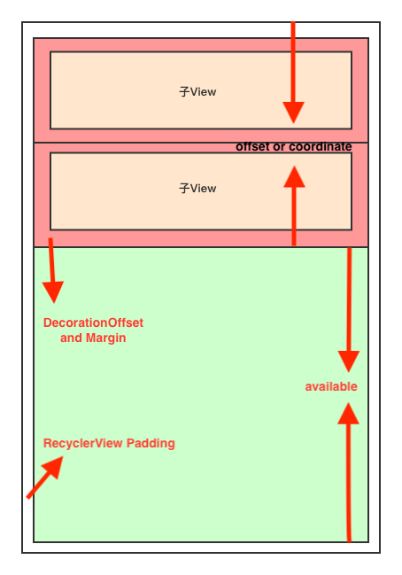

# 流氓控件——RecyclerView（下） 

在上篇内容中我们谈到了，RecyclerView的measure，layout，draw，ItemDecoration，ItemAnimator。第一次measure过程中如果RecyclerView的宽和高的MeasureMode都是Exactly时，进行简单的测量，就直接进入layout流程，但是如果调用了notifyDataSetChanged方法后，在measure过程中就有可能进入LayoutStep1和LayoutStep2；Layout流程一共分为3步，其主要也是为了动画而服务的，真正的Layout是由今天介绍的LayoutManager实现的，Step1主要是记录上次Layout后子View的位置（前提是必须开启动画，同时这个过程中可能会调用LayoutManager的onLayoutChildren方法），Step2就是进行真实的测量，Step3会对Step2 layout后的子View的位置信息进行测量，类似于Step1，然后把前后为位置信息传递给ItemAnimator，然后执行动画；draw流程就比较简单了，直接调用了ItemDecoration的onDraw方法。如果还有不清楚的地方，请查阅上篇内容。  
  
那么开始本篇的正文内容，本篇的内容中包括LayoutManager和Recycler。  


## LayoutManager

本次LayoutManager的代码分析是采用LinearLayoutManager的代码，最简单的LayoutManager，同时也是最强大的LayoutManager，GridLayoutManager也是LinearLayoutManager的派生类。

开始代码分析前先看个图，有助于对代码的理解。  

  

上面的图是从Start向End layout的情况，End到Start layout我就不再给图了，自己想象。

先看两个重要的成员变量类，AnchorInfo和LayoutState。

```java

/**
 * 在onLayoutChildren方法中主要是根据pendding或者当前子View的信息初始化该对象，然后通过该对象再初始化LayoutState。
 */
static class AnchorInfo {
		// orientationHelper这个对象非常有用，可以用来拿子View的各种信息，分为Vertical和Horizontal helper
        OrientationHelper mOrientationHelper;
        // 下次Layout需要的Position
        int mPosition;
        // layout的坐标，见上面的图你就明白了。
        int mCoordinate;
        // Layout的方向start to end 或者 end to start
        boolean mLayoutFromEnd;
        // 是否有效
        boolean mValid;
        
        ...
        
        }
        
    /**
     * Helper class that keeps temporary state while {LayoutManager} is filling out the empty
     * space.
     */
    static class LayoutState {

        ...

        /**
         * We may not want to recycle children in some cases (e.g. layout)
         */
         // 是否会进行回收，在layout时不会回收，scroll的时候会回收
        boolean mRecycle = true;

        /**
         * Pixel offset where layout should start
         */
         // 和coordinate一样见上图
        int mOffset;

        /**
         * Number of pixels that we should fill, in the layout direction.
         */
         // 见上图描述。
        int mAvailable;

        /**
         * Current position on the adapter to get the next item.
         */
         // 当前需要layout的position
        int mCurrentPosition;

        /**
         * Defines the direction in which the data adapter is traversed.
         * Should be {@link #ITEM_DIRECTION_HEAD} or {@link #ITEM_DIRECTION_TAIL}
         */
         // 从adapter中取数据的方向。
        int mItemDirection;

        /**
         * Defines the direction in which the layout is filled.
         * Should be {@link #LAYOUT_START} or {@link #LAYOUT_END}
         */
         // Layout的方向。
        int mLayoutDirection;

        /**
         * Used when LayoutState is constructed in a scrolling state.
         * It should be set the amount of scrolling we can make without creating a new view.
         * Settings this is required for efficient view recycling.
         */
         // 这个值只有在滚动的时候有用，到时候再说。
        int mScrollingOffset;

        /**
         * Used if you want to pre-layout items that are not yet visible.
         * The difference with {@link #mAvailable} is that, when recycling, distance laid out for
         * {@link #mExtraFillSpace} is not considered to avoid recycling visible children.
         */
         // 需要额外填充子view的空间，相当于在available加一个offset
        int mExtraFillSpace = 0;

        /**
         * Contains the {@link #calculateExtraLayoutSpace(RecyclerView.State, int[])}  extra layout
         * space} that should be excluded for recycling when cleaning up the tail of the list during
         * a smooth scroll.
         */
         // 不会触发回收的offset
        int mNoRecycleSpace = 0;

        /**
         * Equal to {@link RecyclerView.State#isPreLayout()}. When consuming scrap, if this value
         * is set to true, we skip removed views since they should not be laid out in post layout
         * step.
         */
         // 是否时PreLayout（就是Layout过程中的Step1）
        boolean mIsPreLayout = false;

        /**
         * The most recent {@link #scrollBy(int, RecyclerView.Recycler, RecyclerView.State)}
         * amount.
         */
         // 上次滚动的距离
        int mLastScrollDelta;

        /**
         * When LLM needs to layout particular views, it sets this list in which case, LayoutState
         * will only return views from this list and return null if it cannot find an item.
         */
         // 和Recycler中的scrapList差不多，Recycler中还会看到它，就是上次Layout中的子View会被detached后放到这个list中
        List<RecyclerView.ViewHolder> mScrapList = null;

        /**
         * Used when there is no limit in how many views can be laid out.
         */
         // 在Layout中是否可以无视available中的值无限layout，直到adapter中的item全部layout。
        boolean mInfinite;
        
        ...
        
        }

```


下面是onLayoutChildren的代码，代码比较长，不过我会给注释的，请放心食用。

```java

@Override
    public void onLayoutChildren(RecyclerView.Recycler recycler, RecyclerView.State state) {
        // layout algorithm:
        // 1) by checking children and other variables, find an anchor coordinate and an anchor
        //  item position.
        // 2) fill towards start, stacking from bottom
        // 3) fill towards end, stacking from top
        // 4) scroll to fulfill requirements like stack from bottom.
        // create layout state
        if (DEBUG) {
            Log.d(TAG, "is pre layout:" + state.isPreLayout());
        }
        
        /**
          * 我暂时把LayoutChildren分为两部分。第一部分为初始化AnchorInfo，初始化AnchorInfo又有两种方法，一种是通过
          * paddingSavedState，这个State是在LayoutManager意外销毁的时候会通过LayoutState保存起来的，恢复的时候又会恢
          * 复padding这个对象，如果你是个有经验的开发者，这种操作应该见得很多了，个人认为这个东西不太好用。还有一种方法是通
          * 过当前的子View状态来初始化AnchorInfo。第二部分为通过AnchorInfo然后初始化LayoutState，然后执行Layout操作。
          *
          */
          
          // 在某些条件下会回收所有的子View，条件就自己看了。
        if (mPendingSavedState != null || mPendingScrollPosition != RecyclerView.NO_POSITION) {
            if (state.getItemCount() == 0) {
                removeAndRecycleAllViews(recycler);
                return;
            }
        }
        if (mPendingSavedState != null && mPendingSavedState.hasValidAnchor()) {
            mPendingScrollPosition = mPendingSavedState.mAnchorPosition;
        }
			
		// 初始化LayoutState
        ensureLayoutState();
        mLayoutState.mRecycle = false;
        // resolve layout direction
        // 初始化Layout的方向
        resolveShouldLayoutReverse();
		
		
		// 初始化AnchorInfo，可以通过有焦点的子View或者pendingState或者可见的最后一个子View（如果Layout方向是End）。详细代码后面分析。
        final View focused = getFocusedChild();
        if (!mAnchorInfo.mValid || mPendingScrollPosition != RecyclerView.NO_POSITION
                || mPendingSavedState != null) {
            mAnchorInfo.reset();
            mAnchorInfo.mLayoutFromEnd = mShouldReverseLayout ^ mStackFromEnd;
            // calculate anchor position and coordinate
            updateAnchorInfoForLayout(recycler, state, mAnchorInfo);
            mAnchorInfo.mValid = true;
        } else if (focused != null && (mOrientationHelper.getDecoratedStart(focused)
                        >= mOrientationHelper.getEndAfterPadding()
                || mOrientationHelper.getDecoratedEnd(focused)
                <= mOrientationHelper.getStartAfterPadding())) {
            // This case relates to when the anchor child is the focused view and due to layout
            // shrinking the focused view fell outside the viewport, e.g. when soft keyboard shows
            // up after tapping an EditText which shrinks RV causing the focused view (The tapped
            // EditText which is the anchor child) to get kicked out of the screen. Will update the
            // anchor coordinate in order to make sure that the focused view is laid out. Otherwise,
            // the available space in layoutState will be calculated as negative preventing the
            // focused view from being laid out in fill.
            // Note that we won't update the anchor position between layout passes (refer to
            // TestResizingRelayoutWithAutoMeasure), which happens if we were to call
            // updateAnchorInfoForLayout for an anchor that's not the focused view (e.g. a reference
            // child which can change between layout passes).
            mAnchorInfo.assignFromViewAndKeepVisibleRect(focused, getPosition(focused));
        }
        if (DEBUG) {
            Log.d(TAG, "Anchor info:" + mAnchorInfo);
        }

        // LLM may decide to layout items for "extra" pixels to account for scrolling target,
        // caching or predictive animations.

        mLayoutState.mLayoutDirection = mLayoutState.mLastScrollDelta >= 0
                ? LayoutState.LAYOUT_END : LayoutState.LAYOUT_START;
        mReusableIntPair[0] = 0;
        mReusableIntPair[1] = 0;
        // 计算可以额外Layout的extra值，分为Start和End的extra值，你可以重写下面的方法，来返回你想要的值。
        calculateExtraLayoutSpace(state, mReusableIntPair);
        int extraForStart = Math.max(0, mReusableIntPair[0])
                + mOrientationHelper.getStartAfterPadding();
        int extraForEnd = Math.max(0, mReusableIntPair[1])
                + mOrientationHelper.getEndPadding();

        // 下面还会根据不同的状态调整这个extra值，没有深入研究这种情况。
        if (state.isPreLayout() && mPendingScrollPosition != RecyclerView.NO_POSITION
                && mPendingScrollPositionOffset != INVALID_OFFSET) {
            // if the child is visible and we are going to move it around, we should layout
            // extra items in the opposite direction to make sure new items animate nicely
            // instead of just fading in
            final View existing = findViewByPosition(mPendingScrollPosition);
            if (existing != null) {
                final int current;
                final int upcomingOffset;
                if (mShouldReverseLayout) {
                    current = mOrientationHelper.getEndAfterPadding()
                            - mOrientationHelper.getDecoratedEnd(existing);
                    upcomingOffset = current - mPendingScrollPositionOffset;
                } else {
                    current = mOrientationHelper.getDecoratedStart(existing)
                            - mOrientationHelper.getStartAfterPadding();
                    upcomingOffset = mPendingScrollPositionOffset - current;
                }
                if (upcomingOffset > 0) {
                    extraForStart += upcomingOffset;
                } else {
                    extraForEnd -= upcomingOffset;
                }
            }
        }
        int startOffset;
        int endOffset;
        final int firstLayoutDirection;
        if (mAnchorInfo.mLayoutFromEnd) {
            firstLayoutDirection = mShouldReverseLayout ? LayoutState.ITEM_DIRECTION_TAIL
                    : LayoutState.ITEM_DIRECTION_HEAD;
        } else {
            firstLayoutDirection = mShouldReverseLayout ? LayoutState.ITEM_DIRECTION_HEAD
                    : LayoutState.ITEM_DIRECTION_TAIL;
        }
		
		// 这个方法是个空实现，在GridLayoutManager中有实现这个方法，然后我们写的LayoutManager没办法实现这个方法，可见性是internal的。
        onAnchorReady(recycler, state, mAnchorInfo, firstLayoutDirection);
        
        // 如果上次的Layout的children没被remove同时没有失效同时没有statableIds（在adapter中可以设置stableIds）就会被直接remove掉然后被recycler回收，反之就会直接放到recycler中的scapeList中，和上面谈到的LayoutStateList中是一样的list。
        detachAndScrapAttachedViews(recycler);
        mLayoutState.mInfinite = resolveIsInfinite();
        mLayoutState.mIsPreLayout = state.isPreLayout();
        // noRecycleSpace not needed: recycling doesn't happen in below's fill
        // invocations because mScrollingOffset is set to SCROLLING_OFFSET_NaN
        mLayoutState.mNoRecycleSpace = 0;
        
        // layout过程也分为了两种情况 Start和End，我们只分析End的这种情况，都大同小异。
        if (mAnchorInfo.mLayoutFromEnd) {
            // fill towards start
            updateLayoutStateToFillStart(mAnchorInfo);
            mLayoutState.mExtraFillSpace = extraForStart;
            fill(recycler, mLayoutState, state, false);
            startOffset = mLayoutState.mOffset;
            final int firstElement = mLayoutState.mCurrentPosition;
            if (mLayoutState.mAvailable > 0) {
                extraForEnd += mLayoutState.mAvailable;
            }
            // fill towards end
            updateLayoutStateToFillEnd(mAnchorInfo);
            mLayoutState.mExtraFillSpace = extraForEnd;
            mLayoutState.mCurrentPosition += mLayoutState.mItemDirection;
            fill(recycler, mLayoutState, state, false);
            endOffset = mLayoutState.mOffset;

            if (mLayoutState.mAvailable > 0) {
                // end could not consume all. add more items towards start
                extraForStart = mLayoutState.mAvailable;
                updateLayoutStateToFillStart(firstElement, startOffset);
                mLayoutState.mExtraFillSpace = extraForStart;
                fill(recycler, mLayoutState, state, false);
                startOffset = mLayoutState.mOffset;
            }
        } else {
            // fill towards end
            // 首先会向end方向通过anchorInfo更新LayoutState
            updateLayoutStateToFillEnd(mAnchorInfo);
            // 同时加上extraEnd的值
            mLayoutState.mExtraFillSpace = extraForEnd;
            // 根据Layout State Layout子View，详细代码后面再分析。
            fill(recycler, mLayoutState, state, false);
            endOffset = mLayoutState.mOffset;
            final int lastElement = mLayoutState.mCurrentPosition;
            
            // 如果还有剩余的空间，会加到extraStart中。
            if (mLayoutState.mAvailable > 0) {
                extraForStart += mLayoutState.mAvailable;
            }
            // fill towards start
            
            // 下面还会向Start方向Layout child，代码和Layout End也基本一样，只是方向不同了而已。
            updateLayoutStateToFillStart(mAnchorInfo);
            mLayoutState.mExtraFillSpace = extraForStart;
            mLayoutState.mCurrentPosition += mLayoutState.mItemDirection;
            fill(recycler, mLayoutState, state, false);
            startOffset = mLayoutState.mOffset;
				
			// 如果在Start方向上还有可用的空间，就会继续在end方向上把这个空间上继续layout children
            if (mLayoutState.mAvailable > 0) {
                extraForEnd = mLayoutState.mAvailable;
                // start could not consume all it should. add more items towards end
                updateLayoutStateToFillEnd(lastElement, endOffset);
                mLayoutState.mExtraFillSpace = extraForEnd;
                fill(recycler, mLayoutState, state, false);
                endOffset = mLayoutState.mOffset;
            }
        }

        // changes may cause gaps on the UI, try to fix them.
        // TODO we can probably avoid this if neither stackFromEnd/reverseLayout/RTL values have
        // changed
        
        /**
          * 这部分代码也非常重要，我之前就忽略了这部分代码，导致在第一个item remove的时候会导致被remove的子View 的空白无
          * 法填充。还有一种情况可能会导致问题，就是在上面分析过的layout过程，End方向：如果fillStart后依然还有空白的空间，
          * 那么就说明已经没有子View可以填充了，但是这个时候start方向上的available大于0，那么呈现出的UI就是在Start方向上
          * 有一段多余的空白。下面这段代码就是为了处理这个问题，其实就是调用了和滚动一样的代码来处理了这段空白，分析滚动的时候
          * 再分析。
          */
        if (getChildCount() > 0) {
            // because layout from end may be changed by scroll to position
            // we re-calculate it.
            // find which side we should check for gaps.
            if (mShouldReverseLayout ^ mStackFromEnd) {
                int fixOffset = fixLayoutEndGap(endOffset, recycler, state, true);
                startOffset += fixOffset;
                endOffset += fixOffset;
                fixOffset = fixLayoutStartGap(startOffset, recycler, state, false);
                startOffset += fixOffset;
                endOffset += fixOffset;
            } else {
                int fixOffset = fixLayoutStartGap(startOffset, recycler, state, true);
                startOffset += fixOffset;
                endOffset += fixOffset;
                fixOffset = fixLayoutEndGap(endOffset, recycler, state, false);
                startOffset += fixOffset;
                endOffset += fixOffset;
            }
        }
        
        /**
          * 看这个方法名字就知道和动画有关，该方法只有在支持PredictiveAnimations且不是preLayout且itemCount不为零才会执
          * 行，上面讲到的LayoutState中的scrapList也只有在这个方法里有写入值。
          * 在我分析的场景中也只是在某个Item中的信息改变后触发了相关逻辑，而且这个layout也直接是将scrapList中的item（这个
          * item并不是改变的那个item，而是在Layout的方向上最后一个可见的item的下一个item）直接添
          * 加到了RecyclerView的viewInfoStore中，如果有看前面分析RecyclerView layout流程的同学应该知道，这里是存放需
          * 要执行动画的地方，但是我经过debug发现，item改变执行动画时，直接将这个多余的Item给Remove掉了。后面分析的时候再
          * 仔细说说这个情况，和其中的好几个过程都有关。
          */
        layoutForPredictiveAnimations(recycler, state, startOffset, endOffset);
        
        if (!state.isPreLayout()) {
        	// 这个方法一定要记得调用一下。
            mOrientationHelper.onLayoutComplete();
        } else {
            mAnchorInfo.reset();
        }
        mLastStackFromEnd = mStackFromEnd;
        if (DEBUG) {
            validateChildOrder();
        }
    }

```

onLayoutChildren代码确实有点长了，代码相对也比较复杂，通过一次就将代码阅读懂难度还是比较大的，我反正读了很多次，如果头脑还有点晕眩，推荐再多看几次，然后再进行后面的内容，跳过layoutForPredictiveAnimations这个方法也是可以的，对整个layout流程影响不大。  

现在继续分析通过penddingState或者子View更新AnchorInfo的代码，方法为updateAnchorInfoForLayout。

```java

    private void updateAnchorInfoForLayout(RecyclerView.Recycler recycler, RecyclerView.State state,
            AnchorInfo anchorInfo) {
            
        // 从pengdingData中更新Anchor，这部分代码就不仔细分析了。
        if (updateAnchorFromPendingData(state, anchorInfo)) {
            if (DEBUG) {
                Log.d(TAG, "updated anchor info from pending information");
            }
            return;
        }
		 // 从上次layout的信息更新Anchor。
        if (updateAnchorFromChildren(recycler, state, anchorInfo)) {
            if (DEBUG) {
                Log.d(TAG, "updated anchor info from existing children");
            }
            return;
        }
        if (DEBUG) {
            Log.d(TAG, "deciding anchor info for fresh state");
        }
        
        // 如果从layout和pendingData中都没有办法更新，那就只有从RecyclerView的初始位置作为coordinate，第一个item作为position（取决于方向）了
        anchorInfo.assignCoordinateFromPadding();
        anchorInfo.mPosition = mStackFromEnd ? state.getItemCount() - 1 : 0;
    }
    
   /**
     * Finds an anchor child from existing Views. Most of the time, this is the view closest to
     * start or end that has a valid position (e.g. not removed).
     * <p>
     * If a child has focus, it is given priority.
     */
    private boolean updateAnchorFromChildren(RecyclerView.Recycler recycler,
            RecyclerView.State state, AnchorInfo anchorInfo) {
        if (getChildCount() == 0) {
            return false;
        }
        
        // 首先检查是否有focused的Child，如果有focused的Child就会以它为基准。
        final View focused = getFocusedChild();
        if (focused != null && anchorInfo.isViewValidAsAnchor(focused, state)) {
        	  //这个方法里面大部分时候也会调用assignFromView方法，等下也直接分析那个方法。
            anchorInfo.assignFromViewAndKeepVisibleRect(focused, getPosition(focused));
            return true;
        }
        if (mLastStackFromEnd != mStackFromEnd) {
            return false;
        }
        
        // 如果layout方向是End，就会以第一个可见的子View作为基准
        View referenceChild = anchorInfo.mLayoutFromEnd
                ? findReferenceChildClosestToEnd(recycler, state)
                : findReferenceChildClosestToStart(recycler, state);
        if (referenceChild != null) {
        	  // 根据view中的信息更新anchorInfo
            anchorInfo.assignFromView(referenceChild, getPosition(referenceChild));
            
            // If all visible views are removed in 1 pass, reference child might be out of bounds.
            // If that is the case, offset it back to 0 so that we use these pre-layout children.
            // 下面的代码不清楚是要处理哪种特殊情况，先跳过。
            if (!state.isPreLayout() && supportsPredictiveItemAnimations()) {
                // validate this child is at least partially visible. if not, offset it to start
                final boolean notVisible =
                        mOrientationHelper.getDecoratedStart(referenceChild) >= mOrientationHelper
                                .getEndAfterPadding()
                                || mOrientationHelper.getDecoratedEnd(referenceChild)
                                < mOrientationHelper.getStartAfterPadding();
                if (notVisible) {
                    anchorInfo.mCoordinate = anchorInfo.mLayoutFromEnd
                            ? mOrientationHelper.getEndAfterPadding()
                            : mOrientationHelper.getStartAfterPadding();
                }
            }
            return true;
        }
        return false;
    }

		
		/**
		  * 这个代码非常简单，没有太多要说的。
		  */
        public void assignFromView(View child, int position) {
            if (mLayoutFromEnd) {
                mCoordinate = mOrientationHelper.getDecoratedEnd(child)
                        + mOrientationHelper.getTotalSpaceChange();
            } else {
                mCoordinate = mOrientationHelper.getDecoratedStart(child);
            }

            mPosition = position;
        }


```

上面分析的更新ancorInfo的代码相对还是比较简单，还有一些方法没有分析，读者可以自己分析，难度也没有特别的大。

extra值的计算分析我就跳过了，在有targetScrollPosition的时候那个会根据滚动的方向在start或者end添加一个RecyclerView内容大小的一个extra值，这段逻辑你是可以自己重写的，代码也比较简单。  

在进行真实的layout之前，会先把上次的layout数据清空掉，而实现这个功能的方法就是detachAndScrapAttachedViews方法。

```java

        /**
         * Temporarily detach and scrap all currently attached child views. Views will be scrapped
         * into the given Recycler. The Recycler may prefer to reuse scrap views before
         * other views that were previously recycled.
         *
         * @param recycler Recycler to scrap views into
         */
        public void detachAndScrapAttachedViews(@NonNull Recycler recycler) {
            final int childCount = getChildCount();
            // 遍历所有的子View然后调用scrapOrRecycleView方法。
            for (int i = childCount - 1; i >= 0; i--) {
                final View v = getChildAt(i);
                scrapOrRecycleView(recycler, i, v);
            }
        }

        private void scrapOrRecycleView(Recycler recycler, int index, View view) {
            final ViewHolder viewHolder = getChildViewHolderInt(view);
            if (viewHolder.shouldIgnore()) {
                if (DEBUG) {
                    Log.d(TAG, "ignoring view " + viewHolder);
                }
                return;
            }
            // 根据条件可能会被直接remove掉然后被recycler回收，或者被detach然后添加到scrapList中。大部分时间都是会被添加到scrapList中，我们分析Recycler的时候还要分析内部具体的实现。
            if (viewHolder.isInvalid() && !viewHolder.isRemoved()
                    && !mRecyclerView.mAdapter.hasStableIds()) {
                removeViewAt(index);
                recycler.recycleViewHolderInternal(viewHolder);
            } else {
                detachViewAt(index);
                recycler.scrapView(view);
                mRecyclerView.mViewInfoStore.onViewDetached(viewHolder);
            }
        }

```

detachAndScrapAttachedViews的处理方式也非常简单，主要逻辑都是recycler担当的，暂时先不分析内部。  


现在分析根据AnchorInfo更新LayoutState的相关代码，一共有两个方法分别是updateLayoutStateToFillStart和updateLayoutStateToFillEnd，这部分代码很简单。

```java

    private void updateLayoutStateToFillEnd(AnchorInfo anchorInfo) {
        updateLayoutStateToFillEnd(anchorInfo.mPosition, anchorInfo.mCoordinate);
    }

    private void updateLayoutStateToFillEnd(int itemPosition, int offset) {
        mLayoutState.mAvailable = mOrientationHelper.getEndAfterPadding() - offset;
        mLayoutState.mItemDirection = mShouldReverseLayout ? LayoutState.ITEM_DIRECTION_HEAD :
                LayoutState.ITEM_DIRECTION_TAIL;
        mLayoutState.mCurrentPosition = itemPosition;
        mLayoutState.mLayoutDirection = LayoutState.LAYOUT_END;
        mLayoutState.mOffset = offset;
        mLayoutState.mScrollingOffset = LayoutState.SCROLLING_OFFSET_NaN;
    }
    
        private void updateLayoutStateToFillStart(AnchorInfo anchorInfo) {
        updateLayoutStateToFillStart(anchorInfo.mPosition, anchorInfo.mCoordinate);
    }

    private void updateLayoutStateToFillStart(int itemPosition, int offset) {
        mLayoutState.mAvailable = offset - mOrientationHelper.getStartAfterPadding();
        mLayoutState.mCurrentPosition = itemPosition;
        mLayoutState.mItemDirection = mShouldReverseLayout ? LayoutState.ITEM_DIRECTION_TAIL :
                LayoutState.ITEM_DIRECTION_HEAD;
        mLayoutState.mLayoutDirection = LayoutState.LAYOUT_START;
        mLayoutState.mOffset = offset;
        mLayoutState.mScrollingOffset = LayoutState.SCROLLING_OFFSET_NaN;

    }

```

上面的代码比较简单，我就没有写注释了，这里要说一点就是因为有了orientationHelper，这LinearLayoutManager就少了很多方向的判断，如果我们写代码的时候有这种很多判断的情况，不妨也可以借鉴下他的这种处理方式。  

接下来就该分析LinearLayoutManager的灵魂方法了，fill是用来根据LayoutState来填充子View的。如果你已经准备好了我们就开始吧。


```java

    /**
     * The magic functions :). Fills the given layout, defined by the layoutState. This is fairly
     * independent from the rest of the {@link LinearLayoutManager}
     * and with little change, can be made publicly available as a helper class.
     *
     * @param recycler        Current recycler that is attached to RecyclerView
     * @param layoutState     Configuration on how we should fill out the available space.
     * @param state           Context passed by the RecyclerView to control scroll steps.
     * @param stopOnFocusable If true, filling stops in the first focusable new child
     * @return Number of pixels that it added. Useful for scroll functions.
     */
    int fill(RecyclerView.Recycler recycler, LayoutState layoutState,
            RecyclerView.State state, boolean stopOnFocusable) {
        // max offset we should set is mFastScroll + available
        // 记录layout前的avalible值是多少
        final int start = layoutState.mAvailable;
        
        // 这部分代码是滚动的时候才会触发的回收逻辑，研究滚动的时候再分析
        if (layoutState.mScrollingOffset != LayoutState.SCROLLING_OFFSET_NaN) {
            // TODO ugly bug fix. should not happen
            if (layoutState.mAvailable < 0) {
                layoutState.mScrollingOffset += layoutState.mAvailable;
            }
            recycleByLayoutState(recycler, layoutState);
        }
        // 剩余空间就是available加上extra的值，extra值我们上面有提到，忘了的同学往前翻一翻。
        int remainingSpace = layoutState.mAvailable + layoutState.mExtraFillSpace;
        LayoutChunkResult layoutChunkResult = mLayoutChunkResult;
        while ((layoutState.mInfinite || remainingSpace > 0) && layoutState.hasMore(state)) {
            layoutChunkResult.resetInternal();
            if (RecyclerView.VERBOSE_TRACING) {
                TraceCompat.beginSection("LLM LayoutChunk");
            }
            // 这里又进入了一个重要的方法，最后的layout结果会放在layoutChunkResult中
            layoutChunk(recycler, state, layoutState, layoutChunkResult);
            if (RecyclerView.VERBOSE_TRACING) {
                TraceCompat.endSection();
            }
            // 如果已经结束直接中断循环
            if (layoutChunkResult.mFinished) {
                break;
            }
            // 根据layout的方向和消费的值来调整offset的值。
            layoutState.mOffset += layoutChunkResult.mConsumed * layoutState.mLayoutDirection;
            /**
             * Consume the available space if:
             * * layoutChunk did not request to be ignored
             * * OR we are laying out scrap children
             * * OR we are not doing pre-layout
             */
             /**
               * 然后根据result中的消费情况再修改available和remainingSpace中的值，在我测试的情况中在item改变
               * 时在layoutStep1中是不会消费这个值的。后面在特殊分析。
               */
            if (!layoutChunkResult.mIgnoreConsumed || layoutState.mScrapList != null
                    || !state.isPreLayout()) {
                layoutState.mAvailable -= layoutChunkResult.mConsumed;
                // we keep a separate remaining space because mAvailable is important for recycling
                remainingSpace -= layoutChunkResult.mConsumed;
            }
				
			  // 如果是滑动的情况还会触发回收逻辑，先跳过。
            if (layoutState.mScrollingOffset != LayoutState.SCROLLING_OFFSET_NaN) {
                layoutState.mScrollingOffset += layoutChunkResult.mConsumed;
                if (layoutState.mAvailable < 0) {
                    layoutState.mScrollingOffset += layoutState.mAvailable;
                }
                recycleByLayoutState(recycler, layoutState);
            }
            if (stopOnFocusable && layoutChunkResult.mFocusable) {
                break;
            }
        }
        if (DEBUG) {
            validateChildOrder();
        }
        // 最后返回消费了的available大小
        return start - layoutState.mAvailable;
    }


    void layoutChunk(RecyclerView.Recycler recycler, RecyclerView.State state,
            LayoutState layoutState, LayoutChunkResult result) {
        // 获取一个子View要么是从scrapList中取得，要么是从recycler中取的。
        View view = layoutState.next(recycler);
        if (view == null) {
            if (DEBUG && layoutState.mScrapList == null) {
                throw new RuntimeException("received null view when unexpected");
            }
            // if we are laying out views in scrap, this may return null which means there is
            // no more items to layout.
            result.mFinished = true;
            return;
        }
        RecyclerView.LayoutParams params = (RecyclerView.LayoutParams) view.getLayoutParams();
        if (layoutState.mScrapList == null) {
        	// 将子View添加到recyclerView中。
            if (mShouldReverseLayout == (layoutState.mLayoutDirection
                    == LayoutState.LAYOUT_START)) {
                addView(view);
            } else {
                addView(view, 0);
            }
        } else {
           // 这种情况只有在layoutForPredictiveAnimations这个方法中才会走这个逻辑
            if (mShouldReverseLayout == (layoutState.mLayoutDirection
                    == LayoutState.LAYOUT_START)) {
                // 这个方法其实就是直接对RecyclerView中的viewInfoStore进行操作，然后打上DISAPPEARED的flag，最后执行动画
                addDisappearingView(view);
            } else {
                addDisappearingView(view, 0);
            }
        }
        // 进行测量操作
        measureChildWithMargins(view, 0, 0);
        // 测量后获取消耗后的值
        result.mConsumed = mOrientationHelper.getDecoratedMeasurement(view);
        int left, top, right, bottom;
        
        // 根据不同的情况计算出layout的位置。
        if (mOrientation == VERTICAL) {
            if (isLayoutRTL()) {
                right = getWidth() - getPaddingRight();
                left = right - mOrientationHelper.getDecoratedMeasurementInOther(view);
            } else {
                left = getPaddingLeft();
                right = left + mOrientationHelper.getDecoratedMeasurementInOther(view);
            }
            if (layoutState.mLayoutDirection == LayoutState.LAYOUT_START) {
                bottom = layoutState.mOffset;
                top = layoutState.mOffset - result.mConsumed;
            } else {
                top = layoutState.mOffset;
                bottom = layoutState.mOffset + result.mConsumed;
            }
        } else {
            top = getPaddingTop();
            bottom = top + mOrientationHelper.getDecoratedMeasurementInOther(view);

            if (layoutState.mLayoutDirection == LayoutState.LAYOUT_START) {
                right = layoutState.mOffset;
                left = layoutState.mOffset - result.mConsumed;
            } else {
                left = layoutState.mOffset;
                right = layoutState.mOffset + result.mConsumed;
            }
        }
        // We calculate everything with View's bounding box (which includes decor and margins)
        // To calculate correct layout position, we subtract margins.
        // 直接layout
        layoutDecoratedWithMargins(view, left, top, right, bottom);
        if (DEBUG) {
            Log.d(TAG, "laid out child at position " + getPosition(view) + ", with l:"
                    + (left + params.leftMargin) + ", t:" + (top + params.topMargin) + ", r:"
                    + (right - params.rightMargin) + ", b:" + (bottom - params.bottomMargin));
        }
        // Consume the available space if the view is not removed OR changed
        // 如果是removed或者changed就会忽略消费
        if (params.isItemRemoved() || params.isItemChanged()) {
            result.mIgnoreConsumed = true;
        }
        result.mFocusable = view.hasFocusable();
    }
	
	    /**
         * Gets the view for the next element that we should layout.
         * Also updates current item index to the next item, based on {@link #mItemDirection}
         *
         * @return The next element that we should layout.
         */
        View next(RecyclerView.Recycler recycler) {
        	// 如果scrapList不为空就从其中拿View，为空就从recycler中拿View，只有在layoutForPredictiveAnimations方法中scrapList才不为空。
            if (mScrapList != null) {
                return nextViewFromScrapList();
            }
            final View view = recycler.getViewForPosition(mCurrentPosition);
            mCurrentPosition += mItemDirection;
            return view;
        }
	

```

*The magic functions :).* Google的工程师还调皮了一下，fill方法就分析到这里。onLayoutChildren方法大部分都已经走通。
这里再总结一下主要流程吧，首先会根据pendingData和focused子View和子View来更新AnchorInfo, 接下来会detach掉上次layout的View，绝大部分情况都会被添加到scrapList中，后面就是根据AnchorInfo来填充子View，我这里以End方向为例：首先通过anchorInfo以End方向更新LayoutState，然后再向End方向填充；End方向填充完成后，通过AnchorInfo向Start方向更新LayoutState然后填充；如果在start方向上还有剩余的空间，还会继续向End方向填充一次。这里稍微提示一下，前面提到在fill之前会把上次的layout子View移动到scrapList中，在fill过程中会从recycler中取子View，recycler会优先从scrapList中寻找，当该子View被Layout后会被从scrapList中remove掉。这个时候可能展示给用户的UI可能是有问题的，还会在有空白的方向移动，填充完空白。如果满足layoutAnimator的条件，如果scrapList中还有View就会把这些View的高度记录下来，然后把这些高度作为available继续填充子View，但是这些View也会被添加到RecyclerView的mViewInfoStore对象中用于动画。  


这里继续填补一下上面提到的layoutForPredictiveAnimations这个方法的坑，我就以itemChanged这种情况来分析。先上这个方法的代码：

```java

   /**
     * If necessary, layouts new items for predictive animations
     */
    private void layoutForPredictiveAnimations(RecyclerView.Recycler recycler,
            RecyclerView.State state, int startOffset,
            int endOffset) {
        // If there are scrap children that we did not layout, we need to find where they did go
        // and layout them accordingly so that animations can work as expected.
        // This case may happen if new views are added or an existing view expands and pushes
        // another view out of bounds.
        if (!state.willRunPredictiveAnimations() ||  getChildCount() == 0 || state.isPreLayout()
                || !supportsPredictiveItemAnimations()) {
            return;
        }
        // to make the logic simpler, we calculate the size of children and call fill.
        int scrapExtraStart = 0, scrapExtraEnd = 0;
        final List<RecyclerView.ViewHolder> scrapList = recycler.getScrapList();
        final int scrapSize = scrapList.size();
        final int firstChildPos = getPosition(getChildAt(0));
        
        // 获取scrapList中的Item，然后在extar Start或者End方向上记录。
        for (int i = 0; i < scrapSize; i++) {
            RecyclerView.ViewHolder scrap = scrapList.get(i);
            if (scrap.isRemoved()) {
                continue;
            }
            final int position = scrap.getLayoutPosition();
            final int direction = position < firstChildPos != mShouldReverseLayout
                    ? LayoutState.LAYOUT_START : LayoutState.LAYOUT_END;
            if (direction == LayoutState.LAYOUT_START) {
                scrapExtraStart += mOrientationHelper.getDecoratedMeasurement(scrap.itemView);
            } else {
                scrapExtraEnd += mOrientationHelper.getDecoratedMeasurement(scrap.itemView);
            }
        }

        if (DEBUG) {
            Log.d(TAG, "for unused scrap, decided to add " + scrapExtraStart
                    + " towards start and " + scrapExtraEnd + " towards end");
        }
        // 给layout state的scrapList中赋值，这个就是recycler中的scrapList
        mLayoutState.mScrapList = scrapList;
        
        // 在start方向上fill
        if (scrapExtraStart > 0) {
            View anchor = getChildClosestToStart();
            updateLayoutStateToFillStart(getPosition(anchor), startOffset);
            mLayoutState.mExtraFillSpace = scrapExtraStart;
            mLayoutState.mAvailable = 0;
            mLayoutState.assignPositionFromScrapList();
            fill(recycler, mLayoutState, state, false);
        }
		
		 // 在End方向上fill
        if (scrapExtraEnd > 0) {
            View anchor = getChildClosestToEnd();
            updateLayoutStateToFillEnd(getPosition(anchor), endOffset);
            mLayoutState.mExtraFillSpace = scrapExtraEnd;
            mLayoutState.mAvailable = 0;
            mLayoutState.assignPositionFromScrapList();
            fill(recycler, mLayoutState, state, false);
        }
        // 清空scrapList
        mLayoutState.mScrapList = null;
    }

```
这部分代码也没有特别复杂，上面也有提到过这个方法干的事情。当ItemChanged的时候会触发RecyclerView的measure和layout流程，在layout Step1的首先会把上次layout的child添加到scrapList中，然后进行fill操作，这个时候有一个item已经被标记成了ItemChanged，在fill的时候就不会消费available，也就是说其实这个时候会多layout一个child，具体代码请参考fill方法和layoutChuank方法。这是进入Layout Step2，同样会把Step1的layout结果添加到scrapList中，注意这里会多添加一个，因为Step1的时候多layout了一个child，这时Step2进行fill时会消费scrapList中的View，最后会剩下一个View，这时会进入layoutForPredictiveAnimations，在layoutAnimations的时候会记录这个View的size，然后在对应的layout方向和把那View的size当成extra值继续fill，和一般的fill不同的是会将这个child添加到RecyclerView的mViewInfoStore对象中，为layout Step3中执行动画做准备。但是我经过debug发现，在默认的ItemAnimator中并没有执行动画，而是直接将这个View给Remove掉了，可能这种情况并不能满足动画的条件。  

onLayoutChildren的方法算是分析完了，如果到这里你就以为分析LayoutManager就结束了，那就大错特错了。还有很重要的滑动情况还没有分析，让我们整理下心情继续出发。   

canScrollVertically和canScrollHorizontally是用来控制LayoutManager方法是否能够垂直滑动或者水平滑动，scrollHorizontallyBy和scrollVerticallyBy是用来消费RecyclerView传递过来的滑动距离。我们以scrollVerticallyBy来分析LinearLayoutManager滑动的处理。

```java

    /**
     * {@inheritDoc}
     */
    /**
      * 如果是手指向上滑动dy>0, 反之dy<0. 该方法的返回值是本次滑动消费的距离。
      */
    @Override
    public int scrollVerticallyBy(int dy, RecyclerView.Recycler recycler,
            RecyclerView.State state) {
        if (mOrientation == HORIZONTAL) {
            return 0;
        }
        return scrollBy(dy, recycler, state);
    }
    
    int scrollBy(int delta, RecyclerView.Recycler recycler, RecyclerView.State state) {
        if (getChildCount() == 0 || delta == 0) {
            return 0;
        }
        ensureLayoutState();
        // 支持回收，layoutChildren的时候不支持回收的
        mLayoutState.mRecycle = true;
        final int layoutDirection = delta > 0 ? LayoutState.LAYOUT_END : LayoutState.LAYOUT_START;
        final int absDelta = Math.abs(delta);
        // 更新通过滑动来更新LayoutState，这个方法比较重要等下在具体分析
        updateLayoutState(layoutDirection, absDelta, true, state);
        
        // 滑动的处理也是调用的fill方法。最后的返回值就是消费的大小。
        final int consumed = mLayoutState.mScrollingOffset
                + fill(recycler, mLayoutState, state, false);
        if (consumed < 0) {
            if (DEBUG) {
                Log.d(TAG, "Don't have any more elements to scroll");
            }
            return 0;
        }
        // 根据滑动的方向调整scrolled的值
        final int scrolled = absDelta > consumed ? layoutDirection * consumed : delta;
        // 因为fill方法里面只是控制view的填充和回收，并不会移动其中的children，而helper这里处理的就是移动。
        mOrientationHelper.offsetChildren(-scrolled);
        if (DEBUG) {
            Log.d(TAG, "scroll req: " + delta + " scrolled: " + scrolled);
        }
        mLayoutState.mLastScrollDelta = scrolled;
        return scrolled;
    }

```

在scrollBy方法里也是用到了fill方法来填充子View，不愧是 The Magic Functions。接下来我们分析下通过滑动的值如何更新LayoutState的吧。

```java
    private void updateLayoutState(int layoutDirection, int requiredSpace,
            boolean canUseExistingSpace, RecyclerView.State state) {
        // If parent provides a hint, don't measure unlimited.
        mLayoutState.mInfinite = resolveIsInfinite();
        mLayoutState.mLayoutDirection = layoutDirection;
        mReusableIntPair[0] = 0;
        mReusableIntPair[1] = 0;
        calculateExtraLayoutSpace(state, mReusableIntPair);
        // 计算Extra值都是和前面一样的套路
        int extraForStart = Math.max(0, mReusableIntPair[0]);
        int extraForEnd = Math.max(0, mReusableIntPair[1]);
        boolean layoutToEnd = layoutDirection == LayoutState.LAYOUT_END;
        mLayoutState.mExtraFillSpace = layoutToEnd ? extraForEnd : extraForStart;
        // 这里还把Extra的值添加到了忽略回收的值里面
        mLayoutState.mNoRecycleSpace = layoutToEnd ? extraForStart : extraForEnd;
        int scrollingOffset;
        // 判断滑动的方向
        if (layoutToEnd) {
            mLayoutState.mExtraFillSpace += mOrientationHelper.getEndPadding();
            // get the first child in the direction we are going
            // 找到最后一个Item
            final View child = getChildClosestToEnd();
            // the direction in which we are traversing children
            mLayoutState.mItemDirection = mShouldReverseLayout ? LayoutState.ITEM_DIRECTION_HEAD
                    : LayoutState.ITEM_DIRECTION_TAIL;
            // 更新position
            mLayoutState.mCurrentPosition = getPosition(child) + mLayoutState.mItemDirection;
            // 最后一个Item的末尾作为offset
            mLayoutState.mOffset = mOrientationHelper.getDecoratedEnd(child);
            // calculate how much we can scroll without adding new children (independent of layout)
            // 这个值比较重要，其实就是最后一个子View的End离RecyclerView End的距离。
            scrollingOffset = mOrientationHelper.getDecoratedEnd(child)
                    - mOrientationHelper.getEndAfterPadding();

        } else {
            final View child = getChildClosestToStart();
            mLayoutState.mExtraFillSpace += mOrientationHelper.getStartAfterPadding();
            mLayoutState.mItemDirection = mShouldReverseLayout ? LayoutState.ITEM_DIRECTION_TAIL
                    : LayoutState.ITEM_DIRECTION_HEAD;
            mLayoutState.mCurrentPosition = getPosition(child) + mLayoutState.mItemDirection;
            mLayoutState.mOffset = mOrientationHelper.getDecoratedStart(child);
            scrollingOffset = -mOrientationHelper.getDecoratedStart(child)
                    + mOrientationHelper.getStartAfterPadding();
        }
        mLayoutState.mAvailable = requiredSpace;
        if (canUseExistingSpace) {
        	 // available还会减去一个scrollOffset 
            mLayoutState.mAvailable -= scrollingOffset;
        }
        mLayoutState.mScrollingOffset = scrollingOffset;
    }

```

关于LayoutState中有两个值的计算比较重要，是available和scrollingOffset，其他的值的计算都和layoutChildren中大同小异。如果是垂直手指向上滑动scrollingOffset的值等于最后一个可见的View的End减去RecyclerView的End。available的值为滑动的绝对值减去scrollingOffset。现在分析在说fill方法的时候挖的坑。里面有关回收的代码，只会在滑动的时候才会触发。

```java

// 在执行循环前会执行的回收操作
if (layoutState.mScrollingOffset != LayoutState.SCROLLING_OFFSET_NaN) {
      // TODO ugly bug fix. should not happen
      // 上面提到在计算available的算法是：滑动距离 - scrollingOffset，当滑动距离比较小的时候available的值就有可能为负数。
      // 这种情况下scrollingOffset的值会过大，应该以滑动距离为scrollingOffset
      if (layoutState.mAvailable < 0) {
         layoutState.mScrollingOffset += layoutState.mAvailable;
      }
      // 执行回收操作
      recycleByLayoutState(recycler, layoutState);
}


// 在循环中执行的回收操作
if (layoutState.mScrollingOffset != LayoutState.SCROLLING_OFFSET_NaN) {
	  // scrollingOffset还会加上layout时消费的size
      layoutState.mScrollingOffset += layoutChunkResult.mConsumed;
      if (layoutState.mAvailable < 0) {
         layoutState.mScrollingOffset += layoutState.mAvailable;
      }
      recycleByLayoutState(recycler, layoutState);
}


```

废话不多说，直接看recyclByLayoutState中的代码

```java

    /**
     * Helper method to call appropriate recycle method depending on current layout direction
     *
     * @param recycler    Current recycler that is attached to RecyclerView
     * @param layoutState Current layout state. Right now, this object does not change but
     *                    we may consider moving it out of this view so passing around as a
     *                    parameter for now, rather than accessing {@link #mLayoutState}
     * @see #recycleViewsFromStart(RecyclerView.Recycler, int, int)
     * @see #recycleViewsFromEnd(RecyclerView.Recycler, int, int)
     * @see LinearLayoutManager.LayoutState#mLayoutDirection
     */
    private void recycleByLayoutState(RecyclerView.Recycler recycler, LayoutState layoutState) {
        if (!layoutState.mRecycle || layoutState.mInfinite) {
            return;
        }
        int scrollingOffset = layoutState.mScrollingOffset;
        int noRecycleSpace = layoutState.mNoRecycleSpace;
        if (layoutState.mLayoutDirection == LayoutState.LAYOUT_START) {
            recycleViewsFromEnd(recycler, scrollingOffset, noRecycleSpace);
        } else {
            recycleViewsFromStart(recycler, scrollingOffset, noRecycleSpace);
        }
    }
    
    
    /**
     * Recycles views that went out of bounds after scrolling towards the end of the layout.
     * <p>
     * Checks both layout position and visible position to guarantee that the view is not visible.
     *
     * @param recycler Recycler instance of {@link RecyclerView}
     * @param scrollingOffset This can be used to add additional padding to the visible area. This
     *                        is used to detect children that will go out of bounds after scrolling,
     *                        without actually moving them.
     * @param noRecycleSpace Extra space that should be excluded from recycling. This is the space
     *                       from {@code extraLayoutSpace[0]}, calculated in {@link
     *                       #calculateExtraLayoutSpace}.
     */
    private void recycleViewsFromStart(RecyclerView.Recycler recycler, int scrollingOffset,
            int noRecycleSpace) {
        if (scrollingOffset < 0) {
            if (DEBUG) {
                Log.d(TAG, "Called recycle from start with a negative value. This might happen"
                        + " during layout changes but may be sign of a bug");
            }
            return;
        }
        // ignore padding, ViewGroup may not clip children.
        final int limit = scrollingOffset - noRecycleSpace;
        final int childCount = getChildCount();
        if (mShouldReverseLayout) {
            for (int i = childCount - 1; i >= 0; i--) {
                View child = getChildAt(i);
                if (mOrientationHelper.getDecoratedEnd(child) > limit
                        || mOrientationHelper.getTransformedEndWithDecoration(child) > limit) {
                    // stop here
                    recycleChildren(recycler, childCount - 1, i);
                    return;
                }
            }
        } else {
            for (int i = 0; i < childCount; i++) {
                View child = getChildAt(i);
                // 第一个满足end大于limit的View就是RecyclerView中第一个可见的child，而在这个child之前的View都应该被回收
                if (mOrientationHelper.getDecoratedEnd(child) > limit
                        || mOrientationHelper.getTransformedEndWithDecoration(child) > limit) {
                    // stop here
                    // 最终会调用recycler的recycleView方法回收，后面Recycler部分的时候再分析。
                    recycleChildren(recycler, 0, i);
                    return;
                }
            }
        }
    }


```

回收的算法相对也比较简单，也不多说了。这里继续填坑，在onLayoutChildren的时候fill完成后UI是可能有问题的，可能在start方向或者End方向上有空白。

```java

        // changes may cause gaps on the UI, try to fix them.
        // TODO we can probably avoid this if neither stackFromEnd/reverseLayout/RTL values have
        // changed
        if (getChildCount() > 0) {
            // because layout from end may be changed by scroll to position
            // we re-calculate it.
            // find which side we should check for gaps.
            if (mShouldReverseLayout ^ mStackFromEnd) {
                int fixOffset = fixLayoutEndGap(endOffset, recycler, state, true);
                startOffset += fixOffset;
                endOffset += fixOffset;
                fixOffset = fixLayoutStartGap(startOffset, recycler, state, false);
                startOffset += fixOffset;
                endOffset += fixOffset;
            } else {
            		// 当startOffset>0（除去padding）时说明start方向上有空白
                int fixOffset = fixLayoutStartGap(startOffset, recycler, state, true);
                startOffset += fixOffset;
                endOffset += fixOffset;
                // 当endOffset>0(除去padding)时说明end方向上有空白
                fixOffset = fixLayoutEndGap(endOffset, recycler, state, false);
                startOffset += fixOffset;
                endOffset += fixOffset;
            }
        }
        
    /**
     * @return The final offset amount for children
     */
    private int fixLayoutStartGap(int startOffset, RecyclerView.Recycler recycler,
            RecyclerView.State state, boolean canOffsetChildren) {
        // 计算空白的大小
        int gap = startOffset - mOrientationHelper.getStartAfterPadding();
        int fixOffset = 0;
        if (gap > 0) {
            // check if we should fix this gap.
            // 这里直接调用的滚动的方法，来消除空白。
            fixOffset = -scrollBy(gap, recycler, state);
        } else {
            return 0; // nothing to fix
        }
        startOffset += fixOffset;
        if (canOffsetChildren) {
            // re-calculate gap, see if we could fix it
            gap = startOffset - mOrientationHelper.getStartAfterPadding();
            // 如果还存在空白，如果canOffsetChildren这个参数为true，就会强制滚动去除空白。
            if (gap > 0) {
                mOrientationHelper.offsetChildren(-gap);
                return fixOffset - gap;
            }
        }
        return fixOffset;
    }
    

```

Gap空白的坑也填完了，最后再来小小总结一下滑动相关逻辑。以Vertical手指向上滑动为例：首先根据滑动的大小更新LayoutState，将RecyclerView最后的一个子View的End减去RecyclerView的End作为scrollingOffset（如果滑动距离很小这个值就是滑动距离）的值，以滑动距离减去scrollingOffset的值作为available的值，然后执行fill操作，在fill操作之前要回收一次子View，回收的逻辑是：子View的End小于scrollingOffset的值的View都会被回收。fill方法在循环过程中也会执行回收子View的操作，在每次执行完成layoutChunk后都会在scrollingOffset的值上再加一个consume的值，fill完成后再调用orientationHelper的offsetChildren方法来移动所有Children。  

到这里LinearLayoutManager就分析完了，如果还有问题就在重复看一下吧。。


