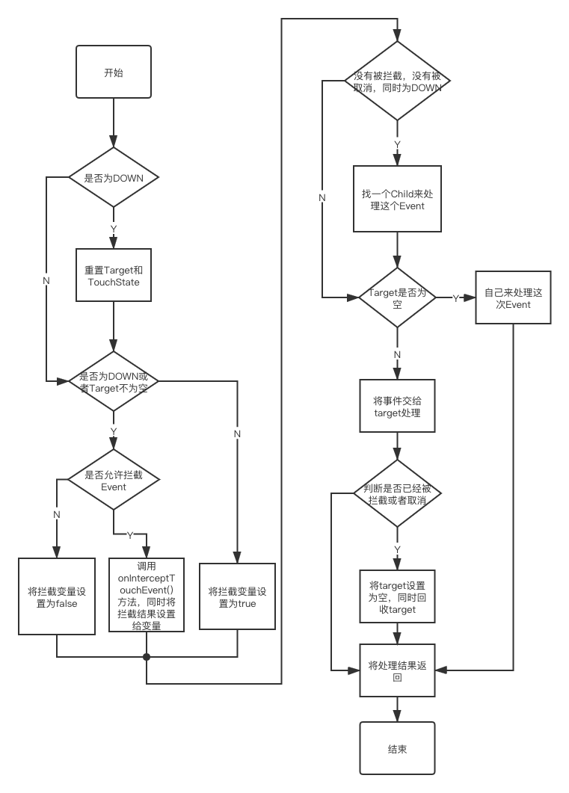

# Android中的触摸事件——MotionEvent的下发

## 前言

  作为一个Android开发者，相信大家对于Android中的触摸事件下发都有些了解。在实际的开发中我们也经常遇到滑动冲突这样的问题，这样的问题是怎样产生的呢？然后有什么方法解决呢？下面从源码去分析一下这个问题吧。
  
  
## 正文

  如果一个ViewGroup需要将某个事件流交给某个子View来处理就会调用子View的`dispatchTouchEvent()`方法，如果子View确定要处理这次事件流`dispatchTouchEvent()`方法就会返回true确认处理，反之返回false。在ViewGroup中的`dispatchTouchEvent()`方法主要是处理事件的下发；而View中的`dispatchTouchEvent()`方法主要是处理这次事件是交给listener处理还是`onTouchEvent`方法处理和滑动的处理。
  
  下面就看一下View中的`dispatchTouchEvent()`方法主要代码： 
  
  
  ```java
  
   /**
     * Pass the touch screen motion event down to the target view, or this
     * view if it is the target.
     *
     * @param event The motion event to be dispatched.
     * @return True if the event was handled by the view, false otherwise.
     */
    public boolean dispatchTouchEvent(MotionEvent event) {
    
       ...
       
        final int actionMasked = event.getActionMasked();
        
        // 如果是ACTION_DOWN事件就会先停止滑动
        if (actionMasked == MotionEvent.ACTION_DOWN) {
            // Defensive cleanup for new gesture
            stopNestedScroll();
        }
		  
		 // 检查一下Event，没有问题进行下一步操作。 
        if (onFilterTouchEventForSecurity(event)) {
            if ((mViewFlags & ENABLED_MASK) == ENABLED && handleScrollBarDragging(event)) {
                result = true;
            }
            //noinspection SimplifiableIfStatement
            ListenerInfo li = mListenerInfo;
            
            // 检查是否有touchListener，如果有将事件交给listener处理，如果listener确认处理，会将result设置为true
            if (li != null && li.mOnTouchListener != null
                    && (mViewFlags & ENABLED_MASK) == ENABLED
                    && li.mOnTouchListener.onTouch(this, event)) {
                result = true;
            }
				
			  // 如果listener没有处理，就会调用onTouchEvent方法来处理，如果已经处理就将result设置为true
            if (!result && onTouchEvent(event)) {
                result = true;
            }
        }
        
        ...
        
        // Clean up after nested scrolls if this is the end of a gesture;
        // also cancel it if we tried an ACTION_DOWN but we didn't want the rest
        // of the gesture.
        // 停止滑动
        if (actionMasked == MotionEvent.ACTION_UP ||
                actionMasked == MotionEvent.ACTION_CANCEL ||
                (actionMasked == MotionEvent.ACTION_DOWN && !result)) {
            stopNestedScroll();
        }

        return result;
    
    }

  
  ```
  
  简单总结下这个方法，如果有添加touchListener那么这个event会优先给listener处理，如果listener没有处理或者为空，那么就会交给onTouchEvent方法处理，反之就不会交给onTouchEvent方法处理。同时将listner或者onTouchEvent方法的处理结果返回；如果是DOWN、UP、CANCEL事件还会停止滑动。  
  上面提到了onTouchEvent方法，在View的这个方法中主要处理了点击事件和长点击事件。所以当listener中处理了Event时，点击事件和长点击事件就会失效。onTouchEvent方法中的具体代码这里就不分析了，留给作为有志青年的你的课后作业。  
  
  下面就分析下ViewGroup方法中`dispatchTouchEvent()`方法，也是本片文章的主要内容。
  
  
  ```java
  
    @Override
    public boolean dispatchTouchEvent(MotionEvent ev) {
    
        ...
        
        boolean handled = false;
        // 安全检查，通过了进行下一步。
        if (onFilterTouchEventForSecurity(ev)) {
            final int action = ev.getAction();
            final int actionMasked = action & MotionEvent.ACTION_MASK;

            // Handle an initial down.
            // 1. 如果是ACTION_DOWN会清除TouchTarget（这是一个链表结构，主要保存处理这次事件的View和pointerID信息，对于我们分析的情况，这个链表只有一个节点）
            // 2. 重置touchState中的一些flag
            if (actionMasked == MotionEvent.ACTION_DOWN) {
                // Throw away all previous state when starting a new touch gesture.
                // The framework may have dropped the up or cancel event for the previous gesture
                // due to an app switch, ANR, or some other state change.
                cancelAndClearTouchTargets(ev);
                resetTouchState();
            }
            
            
            // 下面的代码就是比较重要的Event拦截相关代码。
            // Check for interception.
            final boolean intercepted;
            // 如果action为ACTION_DOWN或者TouchTarget不为空。
            if (actionMasked == MotionEvent.ACTION_DOWN
                    || mFirstTouchTarget != null) {
                // 这个flag比较重要可以控制ViewGroup是否执行拦截方法，可以通过requestDisallowInterceptTouchEvent()方法来设置这个flag，是控制滑动冲突的重要方法。
                final boolean disallowIntercept = (mGroupFlags & FLAG_DISALLOW_INTERCEPT) != 0;
                if (!disallowIntercept) {
                    // 调用onInterceptTouchEvent方法执行拦截逻辑代码，同时把结果保存在变量中。
                    intercepted = onInterceptTouchEvent(ev);
                    ev.setAction(action); // restore action in case it was changed
                } else {
                    intercepted = false;
                }
            } else {
                // There are no touch targets and this action is not an initial down
                // so this view group continues to intercept touches.
                intercepted = true;
            }
            
            ...
            
            // Check for cancelation.
            // 检测是否已经取消
            final boolean canceled = resetCancelNextUpFlag(this)
                    || actionMasked == MotionEvent.ACTION_CANCEL;

            // Update list of touch targets for pointer down, if needed.
            // 在某些情况下，支持多点触控将同一个Event下发至不同的Child，这里我们不做分析。
            final boolean split = (mGroupFlags & FLAG_SPLIT_MOTION_EVENTS) != 0;
            TouchTarget newTouchTarget = null;
            boolean alreadyDispatchedToNewTouchTarget = false;
            
            // 如果没有拦截和取消
            if (!canceled && !intercepted) {

                ...

                // 这里我们也只是考虑ACTION_DOWN的情况 
                if (actionMasked == MotionEvent.ACTION_DOWN
                        || (split && actionMasked == MotionEvent.ACTION_POINTER_DOWN)
                        || actionMasked == MotionEvent.ACTION_HOVER_MOVE) {
                    final int actionIndex = ev.getActionIndex(); // always 0 for down
                    final int idBitsToAssign = split ? 1 << ev.getPointerId(actionIndex)
                            : TouchTarget.ALL_POINTER_IDS;

                    // Clean up earlier touch targets for this pointer id in case they
                    // have become out of sync.
                    removePointersFromTouchTargets(idBitsToAssign);

                    final int childrenCount = mChildrenCount;
                    // 寻找一个子View来处理这次事件流
                    if (newTouchTarget == null && childrenCount != 0) {
                        final float x = ev.getX(actionIndex);
                        final float y = ev.getY(actionIndex);
                        // Find a child that can receive the event.
                        // Scan children from front to back.
                        // 将所有的子View获取Event优先级的顺序排序。默认情况下：1. Z轴高度高的优先。2. 子View的绘制顺序
                        // 这里提一下，Button的默认Z轴高度是大于0的，所以它的优先级比绝大部分View都要高。 
                        final ArrayList<View> preorderedList = buildTouchDispatchChildList();
                        final boolean customOrder = preorderedList == null
                                && isChildrenDrawingOrderEnabled();
                        final View[] children = mChildren;
                        for (int i = childrenCount - 1; i >= 0; i--) {
                            final int childIndex = getAndVerifyPreorderedIndex(
                                    childrenCount, i, customOrder);
                            final View child = getAndVerifyPreorderedView(
                                    preorderedList, children, childIndex);

                            ...
                            
                            // 1. 检测View是否能够接收这次事件(主要是要VISIBLE)
                            // 2. 检测这次事件是否落在该child的范围类
                            // 当上面的条件有一个不满足时，寻找下一个Child
                            if (!child.canReceivePointerEvents()
                                    || !isTransformedTouchPointInView(x, y, child, null)) {
                                ev.setTargetAccessibilityFocus(false);
                                continue;
                            }

                            // 检查是否该View已经在处理这次事件流了，如果已经在处理了，就终止循环。 
                            newTouchTarget = getTouchTarget(child);
                            if (newTouchTarget != null) {
                                // Child is already receiving touch within its bounds.
                                // Give it the new pointer in addition to the ones it is handling.
                                newTouchTarget.pointerIdBits |= idBitsToAssign;
                                break;
                            }

                            resetCancelNextUpFlag(child);
                            
                            // 将这次事件下发给child， dispatchTransformedTouchEvent中的代码等下再简单看一下。
                            if (dispatchTransformedTouchEvent(ev, false, child, idBitsToAssign)) {
                                // 如果Child已经处理了这次事件，执行下面的逻辑。  
                                // Child wants to receive touch within its bounds.
                                
                                // 更新下时间、index、坐标。
                                mLastTouchDownTime = ev.getDownTime();
                                if (preorderedList != null) {
                                    // childIndex points into presorted list, find original index
                                    for (int j = 0; j < childrenCount; j++) {
                                        if (children[childIndex] == mChildren[j]) {
                                            mLastTouchDownIndex = j;
                                            break;
                                        }
                                    }
                                } else {
                                    mLastTouchDownIndex = childIndex;
                                }
                                mLastTouchDownX = ev.getX();
                                mLastTouchDownY = ev.getY();
                                
                                // 将该child添加到TouchTarget中。
                                newTouchTarget = addTouchTarget(child, idBitsToAssign);
                                alreadyDispatchedToNewTouchTarget = true;
                                // 终止循环
                                break;
                            }

                            // The accessibility focus didn't handle the event, so clear
                            // the flag and do a normal dispatch to all children.
                            ev.setTargetAccessibilityFocus(false);
                        }
                        if (preorderedList != null) preorderedList.clear();
                    }

                    ...
                }
            }
            
            // Dispatch to touch targets.
            // 如果没有tachTarget处理就会直接给自己来处理，同时记录处理结果。
            if (mFirstTouchTarget == null) {
                // No touch targets so treat this as an ordinary view.
                handled = dispatchTransformedTouchEvent(ev, canceled, null,
                        TouchTarget.ALL_POINTER_IDS);
            } else {
                // Dispatch to touch targets, excluding the new touch target if we already
                // dispatched to it.  Cancel touch targets if necessary.
                
                // 下面的处理我们不考虑多个target同时处理一个Event，也就是说我们只考虑target只有一个节点的情况。 
                TouchTarget predecessor = null;
                TouchTarget target = mFirstTouchTarget;
                while (target != null) {
                    final TouchTarget next = target.next;
                    // 这个主要针对ACTION_DOWN的情况
                    if (alreadyDispatchedToNewTouchTarget && target == newTouchTarget) {
                        handled = true;
                    } else {
                        
                        // 下面代码针对不是ACTION_DOWN的情况。
                        
                        // 检测是否被拦截或者已经取消。
                        final boolean cancelChild = resetCancelNextUpFlag(target.child)
                                || intercepted;
                        // 下发至child，如果已经取消的话会将action设置为CANCEL。
                        if (dispatchTransformedTouchEvent(ev, cancelChild,
                                target.child, target.pointerIdBits)) {
                            handled = true;
                        }
                        
                        // 如果已经取消或者被拦截这里会回收掉touchTarget，同时把mFirstTouchTarget变量设置为空。
                        if (cancelChild) {
                            if (predecessor == null) {
                                mFirstTouchTarget = next;
                            } else {
                                predecessor.next = next;
                            }
                            target.recycle();
                            target = next;
                            continue;
                        }
                    }
                    predecessor = target;
                    target = next;
                }
            }

            // Update list of touch targets for pointer up or cancel, if needed.
            // 重置touchState
            if (canceled
                    || actionMasked == MotionEvent.ACTION_UP
                    || actionMasked == MotionEvent.ACTION_HOVER_MOVE) {
                resetTouchState();
            } else if (split && actionMasked == MotionEvent.ACTION_POINTER_UP) {
                final int actionIndex = ev.getActionIndex();
                final int idBitsToRemove = 1 << ev.getPointerId(actionIndex);
                removePointersFromTouchTargets(idBitsToRemove);
            }
            
       }
       
       return handled;
    
    }
  
  ```  
  
  
  上面的代码有点长，这里给一个流程图。  
  
  
  
  
  前面提到的滑动冲突处理，上面的代码中已经有提到了，在ViewGroup中可以通过重写`onInterceptTouchEvent()`方法来决定是否拦截这个方法；Child可以通过调用Parent的`requestDisallowInterceptTouchEvent()`方法来设置Parent的flag来禁止parent拦截这次的事件流。注意只能禁止这一次的事件流，因为在DOWN事件的时候回重置这个flag，上面代码中有提到。 
  
 下面简单看一下dispatchTransformedTouchEvent这个方法是如果下发event的。
  
  ```java
 
   /**
     * Transforms a motion event into the coordinate space of a particular child view,
     * filters out irrelevant pointer ids, and overrides its action if necessary.
     * If child is null, assumes the MotionEvent will be sent to this ViewGroup instead.
     */
    private boolean dispatchTransformedTouchEvent(MotionEvent event, boolean cancel,
            View child, int desiredPointerIdBits) {
        final boolean handled;

        // Canceling motions is a special case.  We don't need to perform any transformations
        // or filtering.  The important part is the action, not the contents.
        final int oldAction = event.getAction();
        if (cancel || oldAction == MotionEvent.ACTION_CANCEL) {
            // 如果被取消了，会将ACTION设置为CANCEL
            event.setAction(MotionEvent.ACTION_CANCEL);
            
            // 如果child为空，则自己处理，反之child处理。
            if (child == null) {
                handled = super.dispatchTouchEvent(event);
            } else {
                handled = child.dispatchTouchEvent(event);
            }
            event.setAction(oldAction);
            return handled;
        }

        // Calculate the number of pointers to deliver.
        final int oldPointerIdBits = event.getPointerIdBits();
        final int newPointerIdBits = oldPointerIdBits & desiredPointerIdBits;

        // If for some reason we ended up in an inconsistent state where it looks like we
        // might produce a motion event with no pointers in it, then drop the event.
        if (newPointerIdBits == 0) {
            return false;
        }

        // If the number of pointers is the same and we don't need to perform any fancy
        // irreversible transformations, then we can reuse the motion event for this
        // dispatch as long as we are careful to revert any changes we make.
        // Otherwise we need to make a copy.
        final MotionEvent transformedEvent;
        // 这里又涉及到多点触控时的Event处理，跳过（感觉也没做啥特殊处理）。
        if (newPointerIdBits == oldPointerIdBits) {
            if (child == null || child.hasIdentityMatrix()) {
                if (child == null) {
                    handled = super.dispatchTouchEvent(event);
                } else {
                    final float offsetX = mScrollX - child.mLeft;
                    final float offsetY = mScrollY - child.mTop;
                    event.offsetLocation(offsetX, offsetY);

                    handled = child.dispatchTouchEvent(event);

                    event.offsetLocation(-offsetX, -offsetY);
                }
                return handled;
            }
            transformedEvent = MotionEvent.obtain(event);
        } else {
            transformedEvent = event.split(newPointerIdBits);
        }

        // Perform any necessary transformations and dispatch.
        if (child == null) {
            // 自己处理。
            handled = super.dispatchTouchEvent(transformedEvent);
        } else {
            // 将坐标转换成child中的坐标
            final float offsetX = mScrollX - child.mLeft;
            final float offsetY = mScrollY - child.mTop;
            transformedEvent.offsetLocation(offsetX, offsetY);
            if (! child.hasIdentityMatrix()) {
                transformedEvent.transform(child.getInverseMatrix());
            }
			  // 交给child处理。
            handled = child.dispatchTouchEvent(transformedEvent);
        }

        // Done.
        transformedEvent.recycle();
        return handled;
    }
 
 
  ```  
  
  上面代码简单概括就是如果child为空自己处理，不为空child处理；如果已经取消，将event设置为CANCEL。  
  
  
  
  <br>
  <br>
  <br>
  <br>
  
  MotionEvent事件下发的分析就到这里，如果有错误，欢迎大家指出，一起讨论。下篇内容预定滚动相关。  
  
  
  
  