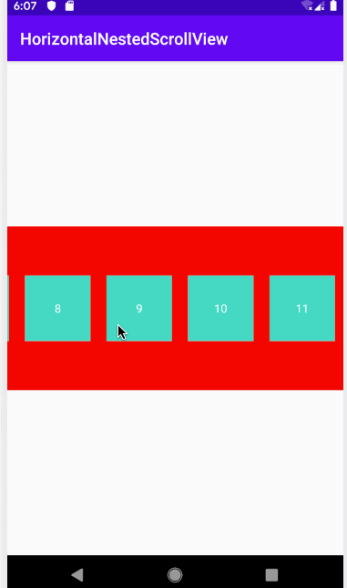

# Android中的触摸事件——嵌套滚动


## 前言

  相信绝大部分的Android开发者都遇到过嵌套滑动冲突的问题，后来Google官方也推出了许多解决嵌套滑动冲突的控件。最经典的就是NestedScrollView和RecyclerView。特别是NestedScrollView，他几乎完全取代了ScrollView。Google的这些嵌套滑动控件绝大部分都是通过实现`NestedScrollingChild3`和`NestedScrollingParent3`这两个接口来实现的。当我明白了他们对于嵌套滑动是如何实现的时候，脑袋中就直接冒出两个字——“妙啊”。下面的内容也是以分析NestedScrollView的代码来分析嵌套滑动的处理。  
  
  
## 正文


### NestedScrollingChild3和NestedScorllingParent3

  就像它们的命名一样，NestedScrollingChild3就是那些需要能够滑动同时希望能够支持嵌套滑动的View实现的接口；NestedScrollingParent3就是能够处理Child中有嵌套滑动View的情况。可能描述有点抽象。这里举个例子：假如一个NestedScrollView中有一个RecyclerView，当RecyclerView滑动到底部的时候，再向上滑动，这个时候NestedScrollView就会滑动。在这个例子中RecyclerView就是Child（NestedScrollingChild3的简称，下文也一样），NestedScrollView就是Parent（NestedScrollingParent3的简称，下文也一样）。当Child滑动到底部的时候，再向上滑动就会通知Parent自己还在滑动但是没有办法消费这个滑动距离，然后让Parent来处理这个未消费的滑动距离，当然Parent也可以不处理，可以找它的Parent来处理，依次类推，可以一直向上找处理这个滑动距离的View。所以一个View即可以是Child也可以是Parent，NestedScrollView就同时实现了这两个接口。  
  
  1. NestedScrollingChild3#startNestedScroll

  这个方法是滑动开始的时候会调用的方法，一般是ACTION\_DOWN的时候会调用这个方法，默认情况下，这个方法回去找实现了Parent接口的父View，如果找到了这个View然后就会调用Parent的onStartNestedScroll方法，如果这个方法返回true，表示父View接受了Child的嵌套滑动，Child这时就会把这个Parent保存下来，同时再调用Parent的onNestedScrollAccepted方法，这个方法中会吧Child的滚动方向记录下来。总结一下就是：Child#startNestedScroll -> Parent#onStartNestedScroll -> Parent#onNestedScrollAccepted
  
  2. NestedScrollingChild3#dispatchNestedPreScroll
  
  在Child准备滑动之前会调用这个方法，然后再调用startNestedScroll过程中找到的Parent的onNestedPreScroll方法。这个过程做一个简单的比喻：就好比你想要买一个10000块的电脑，然后你要向老板申请，老板可以拒绝你的申请，也可以只让你买8000的，可能同意你买10000的。在这里你就是Child而老板就是Parent，10000就是Child想要滑动的距离。总结：Child#dispatchNestedPreScroll -> Parent#onNestedPreScroll
  
  3. NestedScrollingChild3#dispatchNestedScroll

  当Child滑动完成后，会调用这个方法，然后调用Parent的onNestedScroll方法。这个过程中有可能Child自己并没有消费完这次的滑动距离，然后把这个没有消费完成的距离交给Parent处理，也就是在上面提到的例子。总结：Child#dispatchNestedScroll -> Parent#onNestedScroll
  
  4. NestedScrollingChild3#dispatchNestedPreFling

  当快速滑动前会调用这个方法，这个方法和dispatchNestedPreScroll方法类似，不同的是：这个方法只会返回两种情况，一种是这次快速滑动被Parent处理，另一种是没有被Parent处理。总结：Child#dispatchNestedPreFling-> Parent#onNestedPreFling
  
  5. NestedScrollingChild3#dispatchNestedFling

  当Child确认处理快速滑动后，调用这个方法。然后Parent能够收到Child的滑动的速度。总结：Child#dispatchNestedFling -> Parent#onNestedFling
  
  
  6. NestedScrollingChild3#stopNestedScroll

  结束滑动时调用这个方法和startNestedScroll方法对应。这个方法会调用Parent中的onStopNestedScroll，然后再将parent清空。总结：Child#startNestedScroll -> Parent#onStopNestedScroll  
  
  
  
### Scroller简单介绍

  有的人可能不熟悉Scroller，但是你肯定熟悉ValueAnimator。它们的实现都是大同小异，都是将用来计算一个值到另一个值的变化过程。不同是Scroller是用来计算滑动，ValueAnimator是用来计算动画。在很多的可以滑动的View中都可以见到它的身影。注意它本身并不实际参与View的滑动，View的滑动是View调用`scrollTo`和`scrollBy`这两个方法来滑动的，这两个方法相信大家都很熟悉。  
  这里以快速滑动这个场景举一个例子。快速滑动会调用Scroller的fling方法，这个方法中可以传入开始滑动的位置，滑动的速度，最大和最小滑动的位置。当调用fling方法后然后再调用`postInvalidateOnAnimation`方法，这个方法会申请View的重绘，在重绘的过程中会调用View的`computeScroll`方法，这个方法默认是空实现，需要我们重写，在这个方法中我们可以调用scroller的`computeScrollOffset`来完成这一帧的滑动位置的计算，然后调用View的`scrollTo`或者`scrollBy`来完成实际View滑动，这时如果scroller的计算还没有完成，就再次调用`postInvalidateOnAnimation`方法申请继续重新绘制View。在文章后面的NestedScrollView的代码分析中能够看到这部分的具体代码。  
  
  
### NestedScrollView嵌套滑动的实现  

  经过前面Scroller和嵌套滑动接口知识的铺垫，还有前面两篇系列文章（多点触控，触摸事件下发）的介绍，现在就可以开始对NestedScrollView源码进行分析了。源码分析可能会迟到，但永远不会缺席。  
  
  首先分析的是`onInterceptTouchEvent`方法，这个方法在前面的文章介绍过，用来控制是否拦截子View的触摸事件。  
  
  ```java
  
  
    @Override
    public boolean onInterceptTouchEvent(MotionEvent ev) {
        /*
         * This method JUST determines whether we want to intercept the motion.
         * If we return true, onMotionEvent will be called and we do the actual
         * scrolling there.
         */

        /*
        * Shortcut the most recurring case: the user is in the dragging
        * state and he is moving his finger.  We want to intercept this
        * motion.
        */
        final int action = ev.getAction();
        
        // 如果是MOVE事件同时已经被被拖拽住，直接拦截。
        if ((action == MotionEvent.ACTION_MOVE) && mIsBeingDragged) {
            return true;
        }

        switch (action & MotionEvent.ACTION_MASK) {
            case MotionEvent.ACTION_MOVE: {
                /*
                 * mIsBeingDragged == false, otherwise the shortcut would have caught it. Check
                 * whether the user has moved far enough from his original down touch.
                 */

                /*
                * Locally do absolute value. mLastMotionY is set to the y value
                * of the down event.
                */
                final int activePointerId = mActivePointerId;
                if (activePointerId == INVALID_POINTER) {
                    // If we don't have a valid id, the touch down wasn't on content.
                    break;
                }

                final int pointerIndex = ev.findPointerIndex(activePointerId);
                if (pointerIndex == -1) {
                    Log.e(TAG, "Invalid pointerId=" + activePointerId
                            + " in onInterceptTouchEvent");
                    break;
                }

                final int y = (int) ev.getY(pointerIndex);
                final int yDiff = Math.abs(y - mLastMotionY);
                
                // 当滑动的距离大于touchSlop同时子View嵌套滑动方向不是垂直方向时，该次事件流就会被
                // NestedScrollView接管。这里很重要，我举一个例子：当Child中有一个Button，用户用手按住Button
                // 这个时候NestedScrollView会把这次事件交给Button处理，但是在这个过程中你的手又向上滑动了，那么
                // 这次事件将被NSV拦截掉，然后不再给Button处理，NSV自己处理。
                if (yDiff > mTouchSlop
                        && (getNestedScrollAxes() & ViewCompat.SCROLL_AXIS_VERTICAL) == 0) {
                    
                    // 确认被拖拽
                    mIsBeingDragged = true;
                    mLastMotionY = y;
                    
                    // 初始化velocityTracker，用来计算用户滑动的速度
                    initVelocityTrackerIfNotExists();
                    mVelocityTracker.addMovement(ev);
                    mNestedYOffset = 0;
                    
                    
                    final ViewParent parent = getParent();
                    // 不允许parent拦截，前面事件下发分析文章有讲过。
                    if (parent != null) {
                        parent.requestDisallowInterceptTouchEvent(true);
                    }
                }
                break;
            }

            case MotionEvent.ACTION_DOWN: {
                final int y = (int) ev.getY();
                // 如果点击不再Child内，停止拖拽。
                if (!inChild((int) ev.getX(), y)) {
                    mIsBeingDragged = false;
                    recycleVelocityTracker();
                    break;
                }

                /*
                 * Remember location of down touch.
                 * ACTION_DOWN always refers to pointer index 0.
                 */
                mLastMotionY = y;
                mActivePointerId = ev.getPointerId(0);

                initOrResetVelocityTracker();
                mVelocityTracker.addMovement(ev);
                /*
                 * If being flinged and user touches the screen, initiate drag;
                 * otherwise don't. mScroller.isFinished should be false when
                 * being flinged. We need to call computeScrollOffset() first so that
                 * isFinished() is correct.
                */
                
                // 判断scroller的滑动是否完成，如果没有完成则标记为拖拽。
                mScroller.computeScrollOffset();
                mIsBeingDragged = !mScroller.isFinished();
                
                // 开始嵌套滑动，等下分析下这个方法里面做的事情。
                startNestedScroll(ViewCompat.SCROLL_AXIS_VERTICAL, ViewCompat.TYPE_TOUCH);
                break;
            }

            case MotionEvent.ACTION_CANCEL:
            case MotionEvent.ACTION_UP:
                /* Release the drag */
                mIsBeingDragged = false;
                mActivePointerId = INVALID_POINTER;
                recycleVelocityTracker();
                
                // 滑动到边界的时候，实现弹簧效果（NestedScrollView中没有边界的弹簧效果，后面这个代
                // 码中我就不分析它了），这段代码现目前应该是没有用的。
                if (mScroller.springBack(getScrollX(), getScrollY(), 0, 0, 0, getScrollRange())) {
                    ViewCompat.postInvalidateOnAnimation(this);
                }
                // 结束嵌套滑动
                stopNestedScroll(ViewCompat.TYPE_TOUCH);
                break;
            case MotionEvent.ACTION_POINTER_UP:
            	   
            	   // 多点触控的处理，在前面的文章中有分析，后面在onTouchEvent中再简单分析下。
                onSecondaryPointerUp(ev);
                break;
        }

        /*
        * The only time we want to intercept motion events is if we are in the
        * drag mode.
        */
        // 如果已经被拖拽，就拦截。
        return mIsBeingDragged;
    }
  
  
  ``` 
  
  上面代码中主要是判断拖拽，如果已经拖拽就拦截。这里简单总结下拦截的情况：1. DOWN：当点击的位置不在Child内时，停止拦截。2. DOWN：如果当前滑动未结束，拦截。3. MOVE: 如果Child没有在垂直方向上的滑动，则拦截滑动。
  
  
  下面再分析下`startNestedScroll`和`stopNestedScroll`中的代码：  
  
  
  ```java
  
  	
  	 // 直接调用的Helper中的startNestedScroll方法，这个helper是NestedScrollingChildHelper，还有
  	 // parentHelper，类型是NestedScrollingParentHelper。在初始化这两个helper的时候记得开启嵌套滑动。  
    @Override
    public boolean startNestedScroll(int axes, int type) {
        return mChildHelper.startNestedScroll(axes, type);
    }
  
  
    // NestedScrollingChildHelper#startNestedScroll
    /**
     * Start a new nested scroll for this view.
     *
     * <p>This is a delegate method. Call it from your {@link android.view.View View} subclass
     * method/{@link androidx.core.view.NestedScrollingChild2} interface method with the same
     * signature to implement the standard policy.</p>
     *
     * @param axes Supported nested scroll axes.
     *             See {@link androidx.core.view.NestedScrollingChild2#startNestedScroll(int,
     *             int)}.
     * @return true if a cooperating parent view was found and nested scrolling started successfully
     */
    public boolean startNestedScroll(@ScrollAxis int axes, @NestedScrollType int type) {
        // axes: 滑动的方向，水平和垂直。  
        // type：这里的type一共有两种，TOUCH和NONE TOUCH。分别对应通过Touch滑动和非Touch滑动（例如惯性滑动），
        // 后面很多方法中都有这个参数就不赘述了。
        
        // 如果已经有parent处理了就直接返回。
        if (hasNestedScrollingParent(type)) {
            // Already in progress
            return true;
        }
        
        // 支持嵌套滑动时
        if (isNestedScrollingEnabled()) {
            ViewParent p = mView.getParent();
            View child = mView;
            // 遍历child的parent
            while (p != null) {
            		// 调用Parent的onStartNestedScroll方法，当返回为true时表示，这个parent接收了这次嵌套滑动。 
                if (ViewParentCompat.onStartNestedScroll(p, child, mView, axes, type)) {
                		
                
                		// 这个方法会将这个parent和对应的type保存下来，方便后面的一系列操作。  
                    setNestedScrollingParentForType(type, p);
                    
                    // 调用parent的Accepted方法。
                    ViewParentCompat.onNestedScrollAccepted(p, child, mView, axes, type);
                    return true;
                }
                if (p instanceof View) {
                    child = (View) p;
                }
                p = p.getParent();
            }
        }
        return false;
    }
    
    // NestedScrollView#onStartNestedScroll方法
    // 判断滑动方向是不是水平的，如果是就接受这次嵌套滑动。  
    @Override
    public boolean onStartNestedScroll(@NonNull View child, @NonNull View target, int axes,
            int type) {
        return (axes & ViewCompat.SCROLL_AXIS_VERTICAL) != 0;
    }
    
    // NestedScrollView#onNestedScrollAccepted
    
    // 这里会调用parentHelper的onNestedScrollAccepted方法，然后又调用了startNestedScroll方法（也就是再找
    // 它的parent来处理这次嵌套滑动）。
    @Override
    public void onNestedScrollAccepted(@NonNull View child, @NonNull View target, int axes,
            int type) {
        mParentHelper.onNestedScrollAccepted(child, target, axes, type);
        startNestedScroll(ViewCompat.SCROLL_AXIS_VERTICAL, type);
    }
    
    // NestedScrollingParentHelper#onNestedScrollAccepted
    
    /**
     * Called when a nested scrolling operation initiated by a descendant view is accepted
     * by this ViewGroup.
     *
     * <p>This is a delegate method. Call it from your {@link android.view.ViewGroup ViewGroup}
     * subclass method/{@link androidx.core.view.NestedScrollingParent2} interface method with
     * the same signature to implement the standard policy.</p>
     */
    // 将接受的子View的滑动type保存下来。  
    public void onNestedScrollAccepted(@NonNull View child, @NonNull View target,
            @ScrollAxis int axes, @NestedScrollType int type) {
        if (type == ViewCompat.TYPE_NON_TOUCH) {
            mNestedScrollAxesNonTouch = axes;
        } else {
            mNestedScrollAxesTouch = axes;
        }
    }
  
  ```
  
  这里简单总结下start的过程，Child调用startNestedScroll，这里会寻找一个Parent来处理这次嵌套滑动，Parent会通过调用onStartNestedScroll方法来确认是否（是否是垂直方向）接受这次滑动，如果接受这次滑动，Parent还会调用onNestedScrollAccepted方法同时又调用了自己的startNestedScroll方法（这时的Parent又作为一个Child去寻找它的parent来处理这次嵌套滑动，通俗点来说就是“套娃”，有很多这样的“套娃”操作，后面就不详说明了）。  
  
  
  ```java
  
    
    // NestedScrollView#stopNestedScroll
    @Override
    public void stopNestedScroll(int type) {
        mChildHelper.stopNestedScroll(type);
    }
    
    //NestedScrollingChildHelper#stopNestedScroll
    /**
     * Stop a nested scroll in progress.
     *
     * <p>This is a delegate method. Call it from your {@link android.view.View View} subclass
     * method/{@link androidx.core.view.NestedScrollingChild2} interface method with the same
     * signature to implement the standard policy.</p>
     */
    public void stopNestedScroll(@NestedScrollType int type) {
        ViewParent parent = getNestedScrollingParentForType(type);
        if (parent != null) {
            // 调用Parent的onStopNestedScroll方法
            ViewParentCompat.onStopNestedScroll(parent, mView, type);
            // 清除在start过程中的parent
            setNestedScrollingParentForType(type, null);
        }
    }
    
    // NestedScrollView#onStopNestedScroll
    @Override
    public void onStopNestedScroll(@NonNull View target, int type) {
        
        mParentHelper.onStopNestedScroll(target, type);
        // 又是套娃操作，不多说了
        stopNestedScroll(type);
    }
    
    // NestedScrollingParentHelper
    /**
     * React to a nested scroll operation ending.
     *
     * <p>This is a delegate method. Call it from your {@link android.view.ViewGroup ViewGroup}
     * subclass method/{@link androidx.core.view.NestedScrollingParent2} interface method with
     * the same signature to implement the standard policy.</p>
     */
    public void onStopNestedScroll(@NonNull View target, @NestedScrollType int type) {
        // 清除在accept过程中保存下来的Child的滑动方向。
        if (type == ViewCompat.TYPE_NON_TOUCH) {
            mNestedScrollAxesNonTouch = ViewGroup.SCROLL_AXIS_NONE;
        } else {
            mNestedScrollAxesTouch = ViewGroup.SCROLL_AXIS_NONE;
        }
    }
  
  ```
  上面的stop过程很简单，这里不多说了。 
  
  下面分析重要的`onTouchEvent`方法，滑动的处理主要逻辑都是在这里完成的。 
  
  ```java
  
  
    @Override
    public boolean onTouchEvent(MotionEvent ev) {
        
        // 如果velocityTracker不存在，添加一个对象（用于惯性滑动的速度计算）。
        initVelocityTrackerIfNotExists();

        final int actionMasked = ev.getActionMasked();

        if (actionMasked == MotionEvent.ACTION_DOWN) {
            mNestedYOffset = 0;
        }
		
		 // clone一个MotionEvent用于速度计算
        MotionEvent vtev = MotionEvent.obtain(ev);
        vtev.offsetLocation(0, mNestedYOffset);

        switch (actionMasked) {
            case MotionEvent.ACTION_DOWN: {
                if (getChildCount() == 0) {
                    return false;
                }
                
                // 如果滑动没有完成会先禁止parent对事件的拦截
                if ((mIsBeingDragged = !mScroller.isFinished())) {
                    final ViewParent parent = getParent();
                    if (parent != null) {
                        parent.requestDisallowInterceptTouchEvent(true);
                    }
                }

                /*
                 * If being flinged and user touches, stop the fling. isFinished
                 * will be false if being flinged.
                 */
                // 如果滑动没有完成，停止滑动。
                if (!mScroller.isFinished()) {
                    abortAnimatedScroll();
                }

                // Remember where the motion event started
                mLastMotionY = (int) ev.getY();
                mActivePointerId = ev.getPointerId(0);
                
                // 开始嵌套滑动
                startNestedScroll(ViewCompat.SCROLL_AXIS_VERTICAL, ViewCompat.TYPE_TOUCH);
                break;
            }
            case MotionEvent.ACTION_MOVE:
                final int activePointerIndex = ev.findPointerIndex(mActivePointerId);
                if (activePointerIndex == -1) {
                    Log.e(TAG, "Invalid pointerId=" + mActivePointerId + " in onTouchEvent");
                    break;
                }

                final int y = (int) ev.getY(activePointerIndex);
                int deltaY = mLastMotionY - y;
                
                // 如果没有被拖拽，同时滑动距离大于touchSlop，就会把状态设置为拖拽，禁止parent拦截事件
                if (!mIsBeingDragged && Math.abs(deltaY) > mTouchSlop) {
                    final ViewParent parent = getParent();
                    if (parent != null) {
                        parent.requestDisallowInterceptTouchEvent(true);
                    }
                    mIsBeingDragged = true;
                    if (deltaY > 0) {
                        deltaY -= mTouchSlop;
                    } else {
                        deltaY += mTouchSlop;
                    }
                }
                
                // 如果已经拖拽
                if (mIsBeingDragged) {
                    // Start with nested pre scrolling
                    
                    // 调用dispatchNestedPreScroll方法
                    // delatY：想要滑动的垂直距离。
                    // scrollConsumed：被Parent消费的距离
                    // scrollOffset：当前View的位置位移的距离（这里举个例子：很多人都用过可以折叠的Toolbar吧
                    // ，那种情况下，在滑动的时候就会改变当前View的位置）
                    if (dispatchNestedPreScroll(0, deltaY, mScrollConsumed, mScrollOffset,
                            ViewCompat.TYPE_TOUCH)) {
                        // 减去parent消费的距离
                        deltaY -= mScrollConsumed[1];
                        // View的位移距离
                        mNestedYOffset += mScrollOffset[1];
                    }

                    // Scroll to follow the motion event
                    mLastMotionY = y - mScrollOffset[1];
						
						// 记录下当前的滑动位置，用于后面的实际滑动后的消费距离计算。
                    final int oldY = getScrollY();
                    // 在Y轴上可以滑动的最大距离，最小为0
                    final int range = getScrollRange();
                    
                    // 滑动到边界的处理模式，相信很多人在XML的属性里面见过。
                    final int overscrollMode = getOverScrollMode();
                    boolean canOverscroll = overscrollMode == View.OVER_SCROLL_ALWAYS
                            || (overscrollMode == View.OVER_SCROLL_IF_CONTENT_SCROLLS && range > 0);

                    // Calling overScrollByCompat will call onOverScrolled, which
                    // calls onScrollChanged if applicable.
                    // overScrollByCompat这个方法里面处理实际滑动，当滑动到边界时会返回true，这时会把
                    // velocityTracker清空。
                    if (overScrollByCompat(0, deltaY, 0, getScrollY(), 0, range, 0,
                            0, true) && !hasNestedScrollingParent(ViewCompat.TYPE_TOUCH)) {
                        // Break our velocity if we hit a scroll barrier.
                        mVelocityTracker.clear();
                    }
						
						// 实际滑动消费的距离
                    final int scrolledDeltaY = getScrollY() - oldY;
                    // 没有消费的距离
                    final int unconsumedY = deltaY - scrolledDeltaY;

                    mScrollConsumed[1] = 0;

						// 把没有消费的距离交给Parent，就是我们上面提到过的嵌套滑动的例子。 
                    dispatchNestedScroll(0, scrolledDeltaY, 0, unconsumedY, mScrollOffset,
                            ViewCompat.TYPE_TOUCH, mScrollConsumed);

                    mLastMotionY -= mScrollOffset[1];
                    mNestedYOffset += mScrollOffset[1];
						
						// 这下面的代码就是处理滑动到边界时的气泡一样的UI，主要用到了EdgeEffect这个类完成计算和
						// 绘制，在draw方法里面有具体的绘制代码。
                    if (canOverscroll) {
                        deltaY -= mScrollConsumed[1];
                        ensureGlows();
                        final int pulledToY = oldY + deltaY;
                        if (pulledToY < 0) {
                            EdgeEffectCompat.onPull(mEdgeGlowTop, (float) deltaY / getHeight(),
                                    ev.getX(activePointerIndex) / getWidth());
                            if (!mEdgeGlowBottom.isFinished()) {
                                mEdgeGlowBottom.onRelease();
                            }
                        } else if (pulledToY > range) {
                            EdgeEffectCompat.onPull(mEdgeGlowBottom, (float) deltaY / getHeight(),
                                    1.f - ev.getX(activePointerIndex)
                                            / getWidth());
                            if (!mEdgeGlowTop.isFinished()) {
                                mEdgeGlowTop.onRelease();
                            }
                        }
                        if (mEdgeGlowTop != null
                                && (!mEdgeGlowTop.isFinished() || !mEdgeGlowBottom.isFinished())) {
                            ViewCompat.postInvalidateOnAnimation(this);
                        }
                    }
                }
                break;
            case MotionEvent.ACTION_UP:
                // 计算速度
                final VelocityTracker velocityTracker = mVelocityTracker;
                velocityTracker.computeCurrentVelocity(1000, mMaximumVelocity);
                int initialVelocity = (int) velocityTracker.getYVelocity(mActivePointerId);
                
                // 当滑动的速度大于minVelocity时
                if ((Math.abs(initialVelocity) >= mMinimumVelocity)) {
                    // 如果这次惯性滑动没有被Parent消费，那么自己消费
                    if (!dispatchNestedPreFling(0, -initialVelocity)) {
                        dispatchNestedFling(0, -initialVelocity, true);
                        
                        // 处理惯性滚动的方法
                        fling(-initialVelocity);
                    }
                } else if (mScroller.springBack(getScrollX(), getScrollY(), 0, 0, 0,
                        getScrollRange())) {
                    ViewCompat.postInvalidateOnAnimation(this);
                }
                mActivePointerId = INVALID_POINTER;
                
                // 结束滑动，并初始化一些状态
                endDrag();
                break;
            case MotionEvent.ACTION_CANCEL:
                // 和ACTION_UP相比，去掉了惯性滑动的代码
                if (mIsBeingDragged && getChildCount() > 0) {
                    if (mScroller.springBack(getScrollX(), getScrollY(), 0, 0, 0,
                            getScrollRange())) {
                        ViewCompat.postInvalidateOnAnimation(this);
                    }
                }
                mActivePointerId = INVALID_POINTER;
                endDrag();
                break;
            case MotionEvent.ACTION_POINTER_DOWN: {
                // 多点触控的处理，和我之前分析RecyclerView中的多点触控的处理方式一样。
                // 当有新的触摸点添加到屏幕上的时候，新添加的触摸点接管滑动。 
                final int index = ev.getActionIndex();
                mLastMotionY = (int) ev.getY(index);
                mActivePointerId = ev.getPointerId(index);
                break;
            }
            case MotionEvent.ACTION_POINTER_UP:
                // 多点触控处理
                // 当有触摸点离开时：选择index为0的触摸点，如果离开的是index为0的触摸点，就选择
                // index为1的。
                onSecondaryPointerUp(ev);
                mLastMotionY = (int) ev.getY(ev.findPointerIndex(mActivePointerId));
                break;
        }
		 
		 // 将event添加到velocityTracker用户速度计算
        if (mVelocityTracker != null) {
            mVelocityTracker.addMovement(vtev);
        }
        vtev.recycle();

        return true;
    }

  
    // UP 和 CANCEL 的时候重置一些状态。
    private void endDrag() {
        mIsBeingDragged = false;

        recycleVelocityTracker();
        stopNestedScroll(ViewCompat.TYPE_TOUCH);

        if (mEdgeGlowTop != null) {
            mEdgeGlowTop.onRelease();
            mEdgeGlowBottom.onRelease();
        }
    }
 
  
  ```
  
  上面就是滑动的主要代码和逻辑，这里简单总结一下：1. 首先在ACTION\_DOWN的时候：如果scroller还没有完成，禁止parent的拦截，停止scroller没有完成的滑动，开始一次新的滑动。 2. ACTION\_MOVE：如果确定滑动：禁止parent拦截事件；调用dispatchPreNestedScroll方法，如果parent有消费距离，dy还会再减去parent消费的距离，进行实际的滑动，实际滑动后还会调用dispatchNestedScroll方法将本次滑动的距离和没有消费的距离传个parent， 如果滑动到边界，再处理滑动的气泡UI。3. ACTION\_UP: 计算本次滑动事件的速度，然后交给scroller处理这次快速滑动，同时重置一些状态。
  
  
  下面贴出dispatchNestedPreScroll、dispatchNestedScroll、dispatchNestedPreFling和dispatchNestedFling代码。  
  
  ```java
  
  	 // NestedScrollView#dispatchNestedPreScroll
    @Override
    public boolean dispatchNestedPreScroll(int dx, int dy, int[] consumed, int[] offsetInWindow,
            int type) {
        return mChildHelper.dispatchNestedPreScroll(dx, dy, consumed, offsetInWindow, type);
    }
    
    // NestedScrollingChildHelper#dispatchNestedPreScroll
    /**
     * Dispatch one step of a nested pre-scrolling operation to the current nested scrolling parent.
     *
     * <p>This is a delegate method. Call it from your {@link android.view.View View} subclass
     * method/{@link androidx.core.view.NestedScrollingChild2} interface method with the same
     * signature to implement the standard policy.</p>
     *
     * @return true if the parent consumed any of the nested scroll
     */
    public boolean dispatchNestedPreScroll(int dx, int dy, @Nullable int[] consumed,
            @Nullable int[] offsetInWindow, @NestedScrollType int type) {
        if (isNestedScrollingEnabled()) {
            final ViewParent parent = getNestedScrollingParentForType(type);
            if (parent == null) {
                return false;
            }

            if (dx != 0 || dy != 0) {
                int startX = 0;
                int startY = 0;
                if (offsetInWindow != null) {
                    mView.getLocationInWindow(offsetInWindow);
                    startX = offsetInWindow[0];
                    startY = offsetInWindow[1];
                }

                if (consumed == null) {
                    consumed = getTempNestedScrollConsumed();
                }
                consumed[0] = 0;
                consumed[1] = 0;
                ViewParentCompat.onNestedPreScroll(parent, mView, dx, dy, consumed, type);

                if (offsetInWindow != null) {
                    mView.getLocationInWindow(offsetInWindow);
                    offsetInWindow[0] -= startX;
                    offsetInWindow[1] -= startY;
                }
                return consumed[0] != 0 || consumed[1] != 0;
            } else if (offsetInWindow != null) {
                offsetInWindow[0] = 0;
                offsetInWindow[1] = 0;
            }
        }
        return false;
    }
  	
  	// NestedScrollView#onNestedPreScroll
  	
    @Override
    public void onNestedPreScroll(@NonNull View target, int dx, int dy, @NonNull int[] consumed,
            int type) {
        // 这里又是套娃操作。
        dispatchNestedPreScroll(dx, dy, consumed, null, type);
    }
  	
  
  ```
  
  
  dispatchNestedPreScroll逻辑很简单，就不多说了，最后也有套娃操作。   
  
  
  ```java
  
  	
  	 // NestedScrollView#dispatchNestedScroll
    @Override
    public boolean dispatchNestedScroll(int dxConsumed, int dyConsumed, int dxUnconsumed,
            int dyUnconsumed, int[] offsetInWindow) {
        return mChildHelper.dispatchNestedScroll(dxConsumed, dyConsumed, dxUnconsumed, dyUnconsumed,
                offsetInWindow);
    }
    
    // NestedScrollingChildHelper#dispatchNestedScroll
    /**
     * Dispatch one step of a nested scrolling operation to the current nested scrolling parent.
     *
     * <p>This is a delegate method. Call it from your {@link android.view.View View} subclass
     * method/{@link androidx.core.view.NestedScrollingChild} interface method with the same
     * signature to implement the standard policy.</p>
     *
     * @return <code>true</code> if the parent consumed any of the nested scroll distance
     */
    public boolean dispatchNestedScroll(int dxConsumed, int dyConsumed,
            int dxUnconsumed, int dyUnconsumed, @Nullable int[] offsetInWindow) {
        return dispatchNestedScrollInternal(dxConsumed, dyConsumed, dxUnconsumed, dyUnconsumed,
                offsetInWindow, TYPE_TOUCH, null);
    }
	
	
	// NestedScrollingChildHelper#dispatchNestedScrollInternal
    private boolean dispatchNestedScrollInternal(int dxConsumed, int dyConsumed,
            int dxUnconsumed, int dyUnconsumed, @Nullable int[] offsetInWindow,
            @NestedScrollType int type, @Nullable int[] consumed) {
        if (isNestedScrollingEnabled()) {
            final ViewParent parent = getNestedScrollingParentForType(type);
            if (parent == null) {
                return false;
            }

            if (dxConsumed != 0 || dyConsumed != 0 || dxUnconsumed != 0 || dyUnconsumed != 0) {
                int startX = 0;
                int startY = 0;
                if (offsetInWindow != null) {
                    mView.getLocationInWindow(offsetInWindow);
                    startX = offsetInWindow[0];
                    startY = offsetInWindow[1];
                }

                if (consumed == null) {
                    consumed = getTempNestedScrollConsumed();
                    consumed[0] = 0;
                    consumed[1] = 0;
                }

                ViewParentCompat.onNestedScroll(parent, mView,
                        dxConsumed, dyConsumed, dxUnconsumed, dyUnconsumed, type, consumed);

                if (offsetInWindow != null) {
                    mView.getLocationInWindow(offsetInWindow);
                    offsetInWindow[0] -= startX;
                    offsetInWindow[1] -= startY;
                }
                return true;
            } else if (offsetInWindow != null) {
                // No motion, no dispatch. Keep offsetInWindow up to date.
                offsetInWindow[0] = 0;
                offsetInWindow[1] = 0;
            }
        }
        return false;
    }
    
    // NestedScrollView#onNestedScroll
    
    @Override
    public void onNestedScroll(@NonNull View target, int dxConsumed, int dyConsumed,
            int dxUnconsumed, int dyUnconsumed) {
        onNestedScrollInternal(dyUnconsumed, ViewCompat.TYPE_TOUCH, null);
    }
	
	// 这里需要注意了，这里不仅仅是进行了套娃操作
	private void onNestedScrollInternal(int dyUnconsumed, int type, @Nullable int[] consumed) {
        final int oldScrollY = getScrollY();
        // 消费Child没有消费的距离
        scrollBy(0, dyUnconsumed);
        final int myConsumed = getScrollY() - oldScrollY;

        if (consumed != null) {
            consumed[1] += myConsumed;
        }
        final int myUnconsumed = dyUnconsumed - myConsumed;
		
		 // 套娃操作
        mChildHelper.dispatchNestedScroll(0, myConsumed, 0, myUnconsumed, null, type, consumed);
    }
  
  ```
  
  在NestedScrollView的onNestedScroll方法中，如果对Child没有消费的距离进行了处理。  
  
  
  到这里在NestedScrollView中的嵌套滑动处理的代码都分析完了，Child中调用startXXXXX, stopXXXXX, dispatchXXXX等方法，最后这些方法会调用接受处理的Parent中的onXXXX方法，如果这个Parent也是作为一个Child，还会继续套娃操作，继续调用上面Child对应的方法。这里补充说明下，在`CoordinatorLayout`中它又会把Parent中的onXXXX方法全部交给`Behavior`处理，`Behavior`要处理的事情实在有点多，它可能会处理滑动过程，可能会处理Layout过程。如果有人想要分析`Behavior`，这是一个重要的突破口。  
  
  下面的代码简单分析下NestedScrollView中真实滑动相关的代码。
  
  ```java
  
  	 
  	 // 下面是绘制气泡的代码算法，主要都是EdgeEffect这个对象处理了，还是很简单的。不多描述了。
    @Override
    public void draw(Canvas canvas) {
        super.draw(canvas);
        if (mEdgeGlowTop != null) {
            final int scrollY = getScrollY();
            if (!mEdgeGlowTop.isFinished()) {
                final int restoreCount = canvas.save();
                int width = getWidth();
                int height = getHeight();
                int xTranslation = 0;
                int yTranslation = Math.min(0, scrollY);
                if (Build.VERSION.SDK_INT < Build.VERSION_CODES.LOLLIPOP || getClipToPadding()) {
                    width -= getPaddingLeft() + getPaddingRight();
                    xTranslation += getPaddingLeft();
                }
                if (Build.VERSION.SDK_INT >= Build.VERSION_CODES.LOLLIPOP && getClipToPadding()) {
                    height -= getPaddingTop() + getPaddingBottom();
                    yTranslation += getPaddingTop();
                }
                canvas.translate(xTranslation, yTranslation);
                mEdgeGlowTop.setSize(width, height);
                if (mEdgeGlowTop.draw(canvas)) {
                    ViewCompat.postInvalidateOnAnimation(this);
                }
                canvas.restoreToCount(restoreCount);
            }
            if (!mEdgeGlowBottom.isFinished()) {
                final int restoreCount = canvas.save();
                int width = getWidth();
                int height = getHeight();
                int xTranslation = 0;
                int yTranslation = Math.max(getScrollRange(), scrollY) + height;
                if (Build.VERSION.SDK_INT < Build.VERSION_CODES.LOLLIPOP || getClipToPadding()) {
                    width -= getPaddingLeft() + getPaddingRight();
                    xTranslation += getPaddingLeft();
                }
                if (Build.VERSION.SDK_INT >= Build.VERSION_CODES.LOLLIPOP && getClipToPadding()) {
                    height -= getPaddingTop() + getPaddingBottom();
                    yTranslation -= getPaddingBottom();
                }
                canvas.translate(xTranslation - width, yTranslation);
                canvas.rotate(180, width, 0);
                mEdgeGlowBottom.setSize(width, height);
                if (mEdgeGlowBottom.draw(canvas)) {
                    ViewCompat.postInvalidateOnAnimation(this);
                }
                canvas.restoreToCount(restoreCount);
            }
        }
    }
  
  
  ```
  
  上面绘制气泡的算法还是不难，这里不详细分析了。  
  
  ```java 
  
  	// 这个方法中还支持水平滑动，然而实际的代码中并没有水平滑动的代码。
    boolean overScrollByCompat(int deltaX, int deltaY,
            int scrollX, int scrollY,
            int scrollRangeX, int scrollRangeY,
            int maxOverScrollX, int maxOverScrollY,
            boolean isTouchEvent) {
        final int overScrollMode = getOverScrollMode();
        final boolean canScrollHorizontal =
                computeHorizontalScrollRange() > computeHorizontalScrollExtent();
        final boolean canScrollVertical =
                computeVerticalScrollRange() > computeVerticalScrollExtent();
        final boolean overScrollHorizontal = overScrollMode == View.OVER_SCROLL_ALWAYS
                || (overScrollMode == View.OVER_SCROLL_IF_CONTENT_SCROLLS && canScrollHorizontal);
        final boolean overScrollVertical = overScrollMode == View.OVER_SCROLL_ALWAYS
                || (overScrollMode == View.OVER_SCROLL_IF_CONTENT_SCROLLS && canScrollVertical);
			
        int newScrollX = scrollX + deltaX;
        if (!overScrollHorizontal) {
            maxOverScrollX = 0;
        }
		 
		 // 希望滑动到的最终位置
        int newScrollY = scrollY + deltaY;
        // 当不支持OverScroll的时候最大的OverScroll值为0
        if (!overScrollVertical) {
            maxOverScrollY = 0;
        }

        // Clamp values if at the limits and record
        final int left = -maxOverScrollX;
        final int right = maxOverScrollX + scrollRangeX;
        final int top = -maxOverScrollY;
        final int bottom = maxOverScrollY + scrollRangeY;

        boolean clampedX = false;
        if (newScrollX > right) {
            newScrollX = right;
            clampedX = true;
        } else if (newScrollX < left) {
            newScrollX = left;
            clampedX = true;
        }

        boolean clampedY = false;
        //当滑动的最终的位置大于child的bottom时，最终滑动位置设置为bottom
        if (newScrollY > bottom) {
            newScrollY = bottom;
            clampedY = true;
        } else if (newScrollY < top) {
        	  // 当最终位置小于child的top时，将滑动最终位置设置为top。
            newScrollY = top;
            clampedY = true;
        }

        if (clampedY && !hasNestedScrollingParent(ViewCompat.TYPE_NON_TOUCH)) {
            mScroller.springBack(newScrollX, newScrollY, 0, 0, 0, getScrollRange());
        }

        onOverScrolled(newScrollX, newScrollY, clampedX, clampedY);

        return clampedX || clampedY;
    }
    
    // 直接调用scrollTo方法完成滑动
    @Override
    protected void onOverScrolled(int scrollX, int scrollY,
            boolean clampedX, boolean clampedY) {
        super.scrollTo(scrollX, scrollY);
    }

  
  ```
  
  当调用overScrollByCompat返回为true时，表示已经滑到边界。  
    
  ```java
  
  
    /**
     * Fling the scroll view
     *
     * @param velocityY The initial velocity in the Y direction. Positive
     *                  numbers mean that the finger/cursor is moving down the screen,
     *                  which means we want to scroll towards the top.
     */
    public void fling(int velocityY) {
        if (getChildCount() > 0) {

            mScroller.fling(getScrollX(), getScrollY(), // start
                    0, velocityY, // velocities
                    0, 0, // x
                    Integer.MIN_VALUE, Integer.MAX_VALUE, // y
                    0, 0); // overscroll
            runAnimatedScroll(true);
        }
    }
    
    
    private void runAnimatedScroll(boolean participateInNestedScrolling) {
        if (participateInNestedScrolling) {
        	  // 开始滑动
            startNestedScroll(ViewCompat.SCROLL_AXIS_VERTICAL, ViewCompat.TYPE_NON_TOUCH);
        } else {
            stopNestedScroll(ViewCompat.TYPE_NON_TOUCH);
        }
        // 记录上次滑动的位置
        mLastScrollerY = getScrollY();
        // 请求View重新绘制
        ViewCompat.postInvalidateOnAnimation(this);
    }
    
    // 当重新绘制时会调用这个方法来请求scroll位置的计算。
    @Override
    public void computeScroll() {
		
		 // 如果滑动已经完成，直接返回。 
        if (mScroller.isFinished()) {
            return;
        }

		 // 计算滑动位置
        mScroller.computeScrollOffset();
        
        // 计算出来的y的位置
        final int y = mScroller.getCurrY();
        // dY
        int unconsumed = y - mLastScrollerY;
        mLastScrollerY = y;

        // Nested Scrolling Pre Pass
        mScrollConsumed[1] = 0;
        // 提前告诉Parent自己要滑动了，注意这里的type是NON_TOUCH
        dispatchNestedPreScroll(0, unconsumed, mScrollConsumed, null,
                ViewCompat.TYPE_NON_TOUCH);
        
        // 减去被Parent消费的距离
        unconsumed -= mScrollConsumed[1];

        final int range = getScrollRange();

        if (unconsumed != 0) {
            // Internal Scroll
            final int oldScrollY = getScrollY();
            // 调用滑动代码。
            overScrollByCompat(0, unconsumed, getScrollX(), oldScrollY, 0, range, 0, 0, false);
            
            // 已经滑动的距离
            final int scrolledByMe = getScrollY() - oldScrollY;
            unconsumed -= scrolledByMe;

            // Nested Scrolling Post Pass
            mScrollConsumed[1] = 0;
            
            // 给Parent处理未滑动的距离。
            dispatchNestedScroll(0, scrolledByMe, 0, unconsumed, mScrollOffset,
                    ViewCompat.TYPE_NON_TOUCH, mScrollConsumed);
            unconsumed -= mScrollConsumed[1];
        }
		 
		 // 如果滑动到边界
        if (unconsumed != 0) {
            final int mode = getOverScrollMode();
            final boolean canOverscroll = mode == OVER_SCROLL_ALWAYS
                    || (mode == OVER_SCROLL_IF_CONTENT_SCROLLS && range > 0);
            
           
            if (canOverscroll) {
                ensureGlows();
                
                // 处理滑动气泡动画
                if (unconsumed < 0) {
                    if (mEdgeGlowTop.isFinished()) {
                        mEdgeGlowTop.onAbsorb((int) mScroller.getCurrVelocity());
                    }
                } else {
                    if (mEdgeGlowBottom.isFinished()) {
                        mEdgeGlowBottom.onAbsorb((int) mScroller.getCurrVelocity());
                    }
                }
            }
            // 停止滑动
            abortAnimatedScroll();
        }
		  
		 // 如果嵌套滑动没有结束，请求View刷新，计算下一帧滑动位置。 
        if (!mScroller.isFinished()) {
            ViewCompat.postInvalidateOnAnimation(this);
        } else {
            // 结束这次嵌套滑动。
            stopNestedScroll(ViewCompat.TYPE_NON_TOUCH);
        }
    }
    
    private void abortAnimatedScroll() {
        mScroller.abortAnimation();
        stopNestedScroll(ViewCompat.TYPE_NON_TOUCH);
    }
  
  ```
  
  在嵌套滑动中startNestedScroll和stopNestedScroll这两个方法中总是成对出现，又开始就有结束嘛。fling代码也还是比较简单，前面讲Scroller也有说过，scroller只是负责计算，真实的滑动也还是和onTouchEvent中一样，都是调用的overScrollByCompat方法。上面代码我相信对于你们也没有压力。  
  
  
  One More Thing， 由于NestedScrollView是继承于FrameLayout，默认在测量子View的时候，子View的最大高度是没有办法超过Parent的高度的，如果都没有办法超过Parent，那怎么滑动？所以必须重写measureChild方法
  
  ```java
  
  
    @Override
    protected void measureChild(View child, int parentWidthMeasureSpec,
            int parentHeightMeasureSpec) {
        ViewGroup.LayoutParams lp = child.getLayoutParams();

        int childWidthMeasureSpec;
        int childHeightMeasureSpec;

        childWidthMeasureSpec = getChildMeasureSpec(parentWidthMeasureSpec, getPaddingLeft()
                + getPaddingRight(), lp.width);

		 // 不限制Child的高度。 
        childHeightMeasureSpec = MeasureSpec.makeMeasureSpec(0, MeasureSpec.UNSPECIFIED);

        child.measure(childWidthMeasureSpec, childHeightMeasureSpec);
    }
  
  
  ```
  
  
  Emmmmmm,到这里NestedScrollView的嵌套滚动的源码分析也就完成了，NestedScrollView什么都好，但是不支持水平方向上的嵌套滑动。所以我自己又写了一个支持水平方向上的嵌套滚动View--[HorizontalNestedScrollView](https://github.com/Tans5/HorizontalNestedScrollView/blob/master/horizontalnestedscrollview/src/main/java/com/tans/horizontalnestedscrollview/HorizontalNestedScrollView.kt)。算法基本和NestedScrollView差不多。 
  
  
  
  
 <br>
 <br>
 <br>
 <br>
 前面也提到了，Behavior也会影响嵌套滑动，如果有时间再做一篇关于Behavior相关的文章吧。  